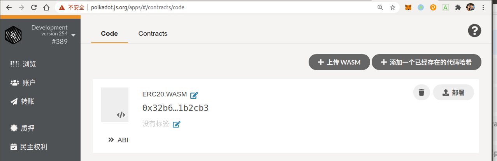
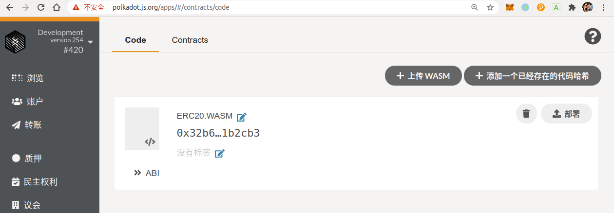
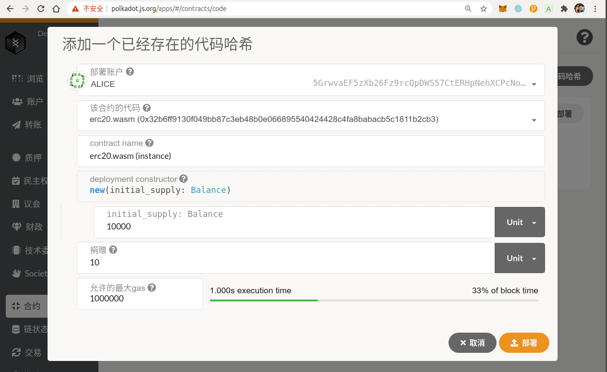
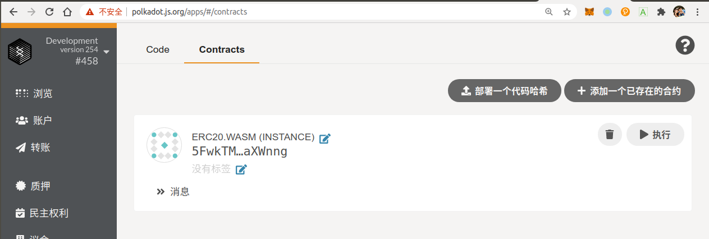
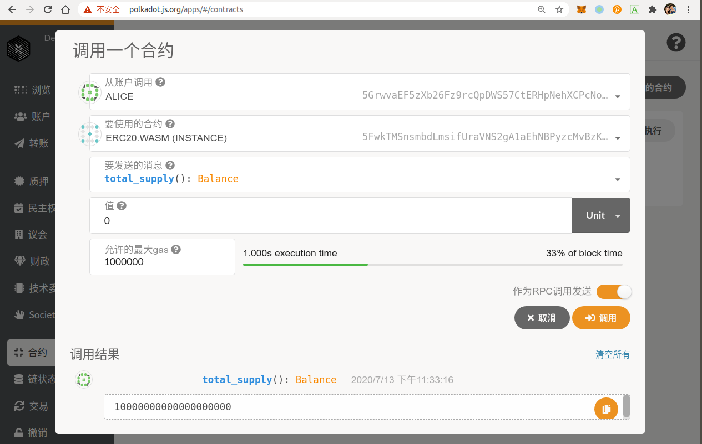
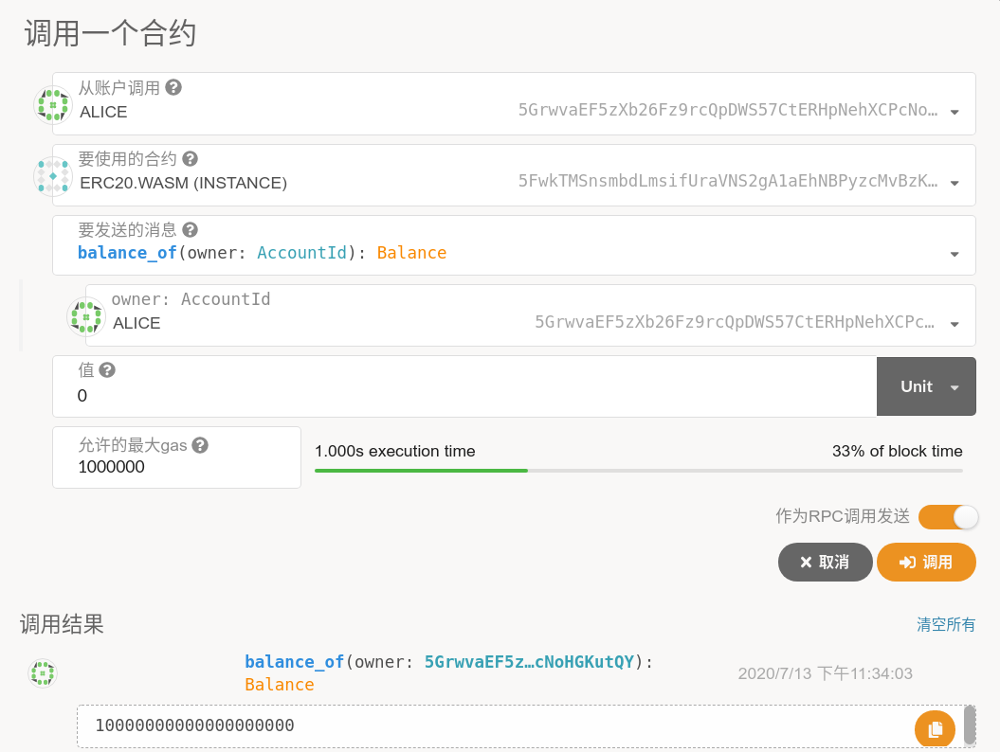
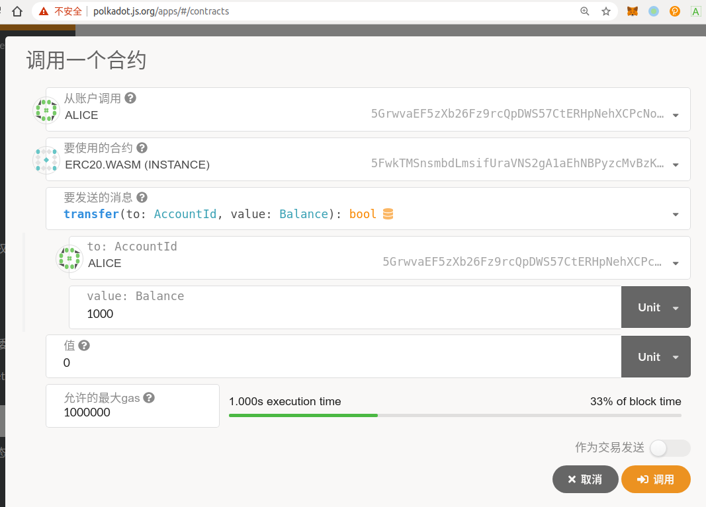
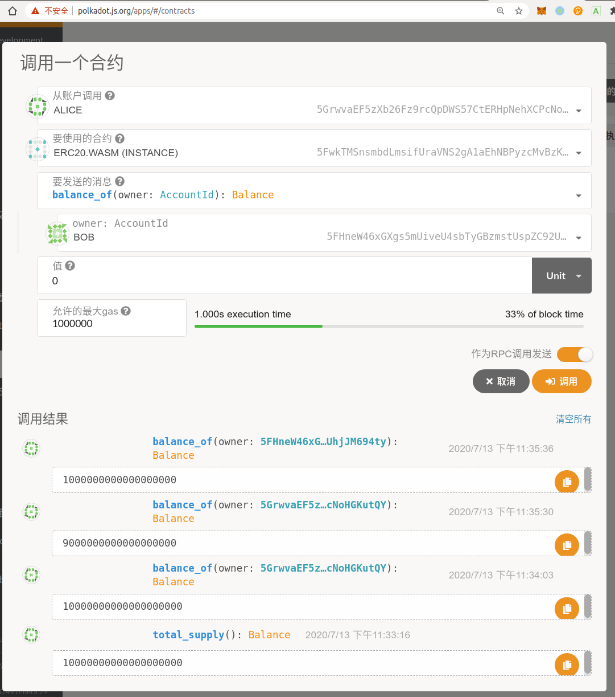
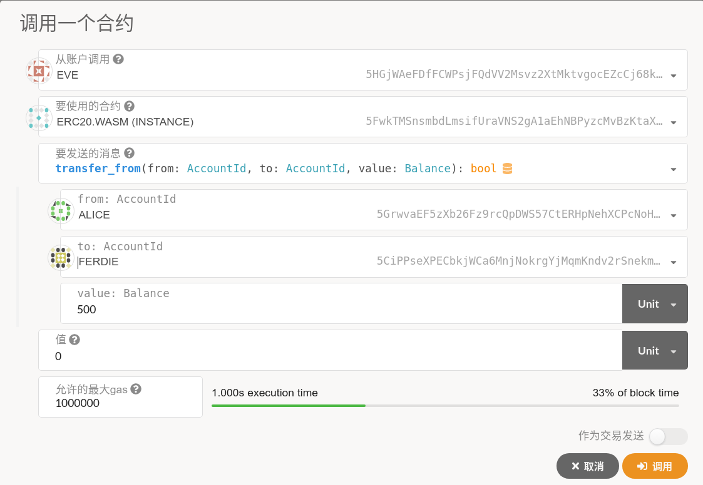
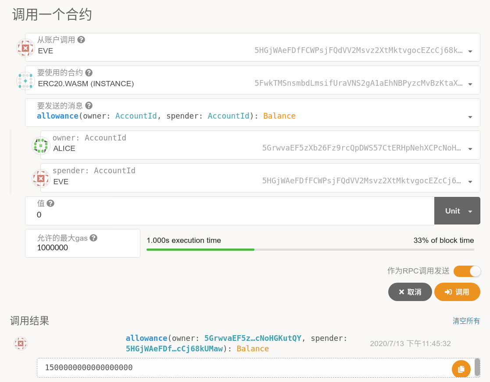

# 使用Ink!开发Substrate ERC20智能合约

[TOC]

## 1 环境搭建

### 1.1 安装Substrate节点

```bash
$ git clone git@github.com:paritytech/substrate.git
$ cd substrate
(master)$ git checkout -b v2.0.0-rc4 v2.0.0-rc4
切换到一个新分支 'v2.0.0-rc4'
(v2.0.0-rc4)$ cargo build --release
```

### 1.2 安装cargo contract插件

- 安装命令

```bash
$ cargo install cargo-contract --vers 0.6.1 --force
```

- 帮助手册

```bash
$ cargo contract --help
cargo-contract 0.6.1
Utilities to develop Wasm smart contracts

USAGE:
    cargo contract <SUBCOMMAND>

OPTIONS:
    -h, --help       Prints help information
    -V, --version    Prints version information

SUBCOMMANDS:
    new                  Setup and create a new smart contract project
    build                Compiles the smart contract
    generate-metadata    Generate contract metadata artifacts
    test                 Test the smart contract off-chain
    help                 Prints this message or the help of the given subcommand(s)
```

## 2 ERC20合约介绍

### 2.1 什么是ERC20标准

ERC20 通证标准（ERC20 Token Standard）是通过以太坊创建通证时的一种规范。按照 ERC20 的规范可以编写一个智能合约，创建“可互换通证”。它并非强制要求，但遵循这个标准，所创建的通证可以与众多交易所、钱包等进行交互，它现在已被行业普遍接受。

ERC20定义了一些标准的接口函数：`balanceOf` 、 `totalSupply` 、`transfer` 、`transferFrom` 、`approve`和`allowance` 。  以及一些可选的字段，例如通证名称、符号以及小数保留位数等。 


详见：https://github.com/ethereum/EIPs/blob/master/EIPS/eip-20.md

### 2.2 ERC20接口

```js
contract ERC20 {
   function totalSupply() constant returns (uint theTotalSupply);
   function balanceOf(address _owner) constant returns (uint balance);
   function transfer(address _to, uint _value) returns (bool success);
   function transferFrom(address _from, address _to, uint _value) returns (bool success);
   function approve(address _spender, uint _value) returns (bool success);
   function allowance(address _owner, address _spender) constant returns (uint remaining);
   event Transfer(address indexed _from, address indexed _to, uint _value);
   event Approval(address indexed _owner, address indexed _spender, uint _value);
}
```

- 功能介绍：

| 函数名         | 功能                                                         |
| -------------- | ------------------------------------------------------------ |
| totalSupply    | 返回存在于流通中的通证（Token）总量                          |
| balanceOf      | 返回指定账户地址的通证余额                                   |
| transfer       | 让调用方将指定数量的通证发送到另一个地址，即转账             |
| transferFrom   | 允许智能合约自动执行转账流程并代表所有者发送给定数量的通证   |
| approve        | 调用方授权给定的地址可以从其地址中提款                       |
| allowance      | 返回被允许转移的余额数量                                     |
| event Transfer | 事件通知，当token被转移时，**必须**调用触发，类似回调，当事件发生时，会得到通知 |
| event Approval | 事件通知，当任何成功调用`approve`后，**必须**调用触发        |

## 3 ERC20合约开发

### 3.1 创建合约工程

执行命令后，会生成2个文件，其中`lib.rs`会包括一些基础框架，我们可以在此基础上开发我们的合约。

```bash
$ cargo contract new erc20
	Created contract erc20
	
$ tree erc20/
erc20/
├── Cargo.toml
└── lib.rs
```

### 3.2 合约存储创建

```rust
    #[ink(storage)]
    struct Erc20 {
        /// 代币发行总量
        total_supply: storage::Value<Balance>,
        /// 用户及余额映射
        balances: storage::HashMap<AccountId, Balance>,
    }
```

### 3.3 合约构造方法创建

```rust
        #[ink(constructor)]
        fn new(&mut self, initial_supply: Balance) {
            let caller = self.env().caller();
            self.total_supply.set(initial_supply);
            self.balances.insert(caller, initial_supply);
        }
```

### 3.4 合约接口方法创建

#### （1）查询代币发行总量接口

```rust
		#[ink(message)]
        fn total_supply(&self) -> Balance {
            *self.total_supply
        }
```

#### （2）查询用户代币余额接口

```rust
        #[ink(message)]
        fn balance_of(&self, owner: AccountId) -> Balance {
            self.balance_of_or_zero(&owner)
        }

		// 工具方法：若用户未被初始化，代币余额置为0
        fn balance_of_or_zero(&self, owner: &AccountId) -> Balance {
            *self.balances.get(owner).unwrap_or(&0)
```

#### （3）转账接口

```rust
        #[ink(message)]
        fn transfer(&mut self, to: AccountId, value: Balance) -> bool {
            // 获取合约接口调用者地址
            let from = self.env().caller();
            // 给接收地址转出指定金额代币
            self.transfer_from_to(from, to, value)
        }

        fn transfer_from_to(&mut self, from: AccountId, to: AccountId, value: Balance) -> bool {
            // 获取合约调用者账户余额
            let from_balance = self.balance_of_or_zero(&from);
            if from_balance < value {
                return false
            }
            // 获取合约接受者账户余额（代币接收者账户可能未被初始化，通过此方法将其余额初始化为0）
            let to_balance = self.balance_of_or_zero(&to);
            // 发送者余额减少指定数量
            self.balances.insert(from, from_balance - value);
            // 接收者余额增加指定数量
            self.balances.insert(to, to_balance + value);
            true
        }
```

我们注意到，在进行余额的增减时，并未像以太坊的`solidity`智能合约，使用额外的`SafeMath`接口，这是因为`ink! `提供了内置防溢出保护，通过在`Cargo.toml` 配置文件中，添加如下配置来提供该安全机制：

> ```toml
> [profile.release]
> panic = "abort"           <-- Panics shall be treated as aborts: reduces binary size
> lto = true                <-- enable link-time-optimization: more efficient codegen
> opt-level = "z"           <-- Optimize for small binary output
> overflow-checks = true    <-- Arithmetic overflow protection
> ```

#### （4）授权转账——授权接口

通过授权转账，调用方可以授权指定账户，从其地址中安全的消费指定数量的代币。

> 需完善合约存储：
>
> ```rust
>     #[ink(storage)]
>     struct Erc20 {
>         ......
>         // (代币所有者, 代币授权使用者) -> 代币授权使用者可支配余额
>         allowances: storage::HashMap<(AccountId, AccountId), Balance>,
>     }
> ```

```rust
        #[ink(message)]
        fn approve(&mut self, spender: AccountId, value: Balance) -> bool {
            let owner = self.env().caller();
            // 代币所有者(owner)授权代币使用者(spender)可支配余额(value)
            self.allowances.insert((owner, spender), value);
            true
        }
```

#### （5）授权转账——余额查询

获取代币授权使用者剩余被允许转移的代币数量。

```rust
        #[ink(message)]
        fn allowance(&self, owner: AccountId, spender: AccountId) -> Balance {
            self.allowance_of_or_zero(&owner, &spender)
        }
```

#### （6）授权转账——转账接口

允许智能合约自动执行转账流程并代表所有者发送给定数量的代币

```rust
        #[ink(message)]
        fn transfer_from(&mut self, from: AccountId, to: AccountId, value: Balance) -> bool {
            let caller = self.env().caller();
            let allowance = self.allowance_of_or_zero(&from, &caller);
            if allowance < value {
                return false
            }
            self.allowances.insert((from, caller), allowance - value);
            self.transfer_from_to(from, to, value)
        }
        
        fn allowance_of_or_zero(&self, owner: &AccountId, spender: &AccountId) -> Balance {
            *self.allowances.get(&(*owner, *spender)).unwrap_or(&0)
        }
```

### 3.5 合约事件创建

- 事件定义

```rust
    #[ink(event)]
    struct Transfer {
        #[ink(topic)]
        from: Option<AccountId>,
        #[ink(topic)]
        to: Option<AccountId>,
        #[ink(topic)]
        value: Balance,
    }

    #[ink(event)]
    struct Approval {
        #[ink(topic)]
        owner: AccountId,
        #[ink(topic)]
        spender: AccountId,
        #[ink(topic)]
        value: Balance,
    }
```

- 合约构造事件

```rust
            self.env().emit_event(Transfer {
                from: None,
                to: Some(caller),
                value: initial_supply,
            });
```

- 转账事件

```rust
            self.env().emit_event(Transfer {
                from: Some(from),
                to: Some(to),
                value,
            });
```

- 授权事件

```rust
            self.env().emit_event(Approval {
                owner,
                spender,
                value,
            });
```

### 3.6 单元测试用例编写

```rust
        #[test]
        fn new_works() {
            let contract = Erc20::new(777);
            assert_eq!(contract.total_supply(), 777);
        }

        #[test]
        fn balance_works() {
            let contract = Erc20::new(100);
            assert_eq!(contract.total_supply(), 100);
            assert_eq!(contract.balance_of(AccountId::from([0x1; 32])), 100);
            assert_eq!(contract.balance_of(AccountId::from([0x0; 32])), 0);
        }

        #[test]
        fn transfer_works() {
            let mut contract = Erc20::new(100);
            assert_eq!(contract.balance_of(AccountId::from([0x1; 32])), 100);
            assert!(contract.transfer(AccountId::from([0x0; 32]), 10));
            assert_eq!(contract.balance_of(AccountId::from([0x0; 32])), 10);
            assert!(!contract.transfer(AccountId::from([0x0; 32]), 100));
        }

        #[test]
        fn transfer_from_works() {
            let mut contract = Erc20::new(100);
            assert_eq!(contract.balance_of(AccountId::from([0x1; 32])), 100);
            contract.approve(AccountId::from([0x1; 32]), 20);
            contract.transfer_from(AccountId::from([0x1; 32]), AccountId::from([0x0; 32]), 10);
            assert_eq!(contract.balance_of(AccountId::from([0x0; 32])), 10);
        }
```

> 跑测试用例：
>
> ```bash
> $ cargo +nightly test
> ```
>
> 

### 3.7 完整代码

```rust
#![cfg_attr(not(feature = "std"), no_std)]

use ink_lang as ink;

#[ink::contract(version = "0.1.0")]
mod erc20 {
    use ink_core::storage;

    #[ink(storage)]
    struct Erc20 {
        /// The total supply.
        total_supply: storage::Value<Balance>,
        /// The balance of each user.
        balances: storage::HashMap<AccountId, Balance>,
        /// Approval spender on behalf of the message's sender.
        allowances: storage::HashMap<(AccountId, AccountId), Balance>,
    }

    #[ink(event)]
    struct Transfer {
        #[ink(topic)]
        from: Option<AccountId>,
        #[ink(topic)]
        to: Option<AccountId>,
        #[ink(topic)]
        value: Balance,
    }

    #[ink(event)]
    struct Approval {
        #[ink(topic)]
        owner: AccountId,
        #[ink(topic)]
        spender: AccountId,
        #[ink(topic)]
        value: Balance,
    }

    impl Erc20 {
        #[ink(constructor)]
        fn new(&mut self, initial_supply: Balance) {
            let caller = self.env().caller();
            self.total_supply.set(initial_supply);
            self.balances.insert(caller, initial_supply);
            self.env().emit_event(Transfer {
                from: None,
                to: Some(caller),
                value: initial_supply,
            });
        }

        #[ink(message)]
        fn total_supply(&self) -> Balance {
            *self.total_supply
        }

        #[ink(message)]
        fn balance_of(&self, owner: AccountId) -> Balance {
            self.balance_of_or_zero(&owner)
        }

        #[ink(message)]
        fn approve(&mut self, spender: AccountId, value: Balance) -> bool {
            let owner = self.env().caller();
            self.allowances.insert((owner, spender), value);
            self.env().emit_event(Approval {
                owner,
                spender,
                value,
            });
            true
        }

        #[ink(message)]
        fn allowance(&self, owner: AccountId, spender: AccountId) -> Balance {
            self.allowance_of_or_zero(&owner, &spender)
        }

        #[ink(message)]
        fn transfer_from(&mut self, from: AccountId, to: AccountId, value: Balance) -> bool {
            let caller = self.env().caller();
            let allowance = self.allowance_of_or_zero(&from, &caller);
            if allowance < value {
                return false
            }
            self.allowances.insert((from, caller), allowance - value);
            self.transfer_from_to(from, to, value)
        }

        #[ink(message)]
        fn transfer(&mut self, to: AccountId, value: Balance) -> bool {
            let from = self.env().caller();
            self.transfer_from_to(from, to, value)
        }

        fn transfer_from_to(&mut self, from: AccountId, to: AccountId, value: Balance) -> bool {
            let from_balance = self.balance_of_or_zero(&from);
            if from_balance < value {
                return false
            }
            let to_balance = self.balance_of_or_zero(&to);
            self.balances.insert(from, from_balance - value);
            self.balances.insert(to, to_balance + value);
            self.env().emit_event(Transfer {
                from: Some(from),
                to: Some(to),
                value,
            });
            true
        }

        fn balance_of_or_zero(&self, owner: &AccountId) -> Balance {
            *self.balances.get(owner).unwrap_or(&0)
        }

        fn allowance_of_or_zero(&self, owner: &AccountId, spender: &AccountId) -> Balance {
            *self.allowances.get(&(*owner, *spender)).unwrap_or(&0)
        }
    }

    #[cfg(test)]
    mod tests {
        use super::*;

        #[test]
        fn new_works() {
            let contract = Erc20::new(777);
            assert_eq!(contract.total_supply(), 777);
        }

        #[test]
        fn balance_works() {
            let contract = Erc20::new(100);
            assert_eq!(contract.total_supply(), 100);
            assert_eq!(contract.balance_of(AccountId::from([0x1; 32])), 100);
            assert_eq!(contract.balance_of(AccountId::from([0x0; 32])), 0);
        }

        #[test]
        fn transfer_works() {
            let mut contract = Erc20::new(100);
            assert_eq!(contract.balance_of(AccountId::from([0x1; 32])), 100);
            assert!(contract.transfer(AccountId::from([0x0; 32]), 10));
            assert_eq!(contract.balance_of(AccountId::from([0x0; 32])), 10);
            assert!(!contract.transfer(AccountId::from([0x0; 32]), 100));
        }

        #[test]
        fn transfer_from_works() {
            let mut contract = Erc20::new(100);
            assert_eq!(contract.balance_of(AccountId::from([0x1; 32])), 100);
            contract.approve(AccountId::from([0x1; 32]), 20);
            contract.transfer_from(AccountId::from([0x1; 32]), AccountId::from([0x0; 32]), 10);
            assert_eq!(contract.balance_of(AccountId::from([0x0; 32])), 10);
        }
    }
}
```

## 4 ERC20合约部署

### 4.1 启动substrate链

```bash
[Jason@RUAN:~/Blockchain/substrate] (v2.0.0-rc4)$ ./target/release/substrate purge-chain --dev
Are you sure to remove "/root/.local/share/substrate/chains/dev/db"? [y/N]: y
"/root/.local/share/substrate/chains/dev/db" did not exist.

[Jason@RUAN:~/Blockchain/substrate] (v2.0.0-rc4)$ ./target/release/substrate  --dev --ws-external --rpc-external --rpc-cors=all
2020-07-13 23:07:17 Substrate Node
2020-07-13 23:07:17 ✌️  version 2.0.0-rc4-00768a1-x86_64-linux-gnu
2020-07-13 23:07:17 ❤️  by Parity Technologies <admin@parity.io>, 2017-2020
2020-07-13 23:07:17 📋 Chain specification: Development
2020-07-13 23:07:17 🏷  Node name: ill-hen-8567
2020-07-13 23:07:17 👤 Role: AUTHORITY
2020-07-13 23:07:17 💾 Database: RocksDb at /root/.local/share/substrate/chains/dev/db
2020-07-13 23:07:17 ⛓  Native runtime: node-254 (substrate-node-0.tx1.au10)
2020-07-13 23:07:17 💸 new validator set of size 1 has been elected via ElectionCompute::OnChain for era 0
2020-07-13 23:07:17 🔨 Initializing Genesis block/state (state: 0xc720…bb8a, header-hash: 0x6ea2…1245)
2020-07-13 23:07:17 👴 Loading GRANDPA authority set from genesis on what appears to be first startup.
2020-07-13 23:07:17 ⏱  Loaded block-time = 3000 milliseconds from genesis on first-launch
2020-07-13 23:07:17 👶 Creating empty BABE epoch changes on what appears to be first startup.
2020-07-13 23:07:17 📦 Highest known block at #0
2020-07-13 23:07:17 Using default protocol ID "sup" because none is configured in the chain specs
2020-07-13 23:07:17 🏷  Local node identity is: 12D3KooWQUQtujJ5SGCdCcheuExioC81R5W4E3RFGhmhx3MT8iqy (legacy representation: QmX71wUqWKy7FQX8PEHKoQLaiBLLTfK8TL25mFXxKhMWGw)
2020-07-13 23:07:17 〽 Prometheus server started at 127.0.0.1:9615
2020-07-13 23:07:17 👶 Starting BABE Authorship worker
2020-07-13 23:07:18 🙌 Starting consensus session on top of parent 0x6ea2a97a8da973976a82f053a8b909aff5e0659ca6d51b6c9d6947b4dc3d1245
2020-07-13 23:07:18 🎁 Prepared block for proposing at 1 [hash: 0x3b99b664d0a21fbc72bfed709700b5bba05564c8d62e9ddd677412896f25de31; parent_hash: 0x6ea2…1245; extrinsics (1): [0xdcda…fb8d]]
2020-07-13 23:07:18 🔖 Pre-sealed block for proposal at 1. Hash now 0x3081484a5cbe82a9b4a4aea4d360fd69219a43d18182c6fd297e2ffac71feff2, previously 0x3b99b664d0a21fbc72bfed709700b5bba05564c8d62e9ddd677412896f25de31.
2020-07-13 23:07:18 👶 New epoch 0 launching at block 0x3081…eff2 (block slot 531550946 >= start slot 531550946).
2020-07-13 23:07:18 👶 Next epoch starts at slot 531551146
2020-07-13 23:07:18 ✨ Imported #1 (0x3081…eff2)
2020-07-13 23:07:21 🙌 Starting consensus session on top of parent 0x3081484a5cbe82a9b4a4aea4d360fd69219a43d18182c6fd297e2ffac71feff2
2020-07-13 23:07:21 🎁 Prepared block for proposing at 2 [hash: 0x346204e0b46b86dc4ec85b18cf2fdf0f0e818b24208e56217e6f44c135e3aef3; parent_hash: 0x3081…eff2; extrinsics (1): [0xfdbb…bdd0]]
2020-07-13 23:07:21 🔖 Pre-sealed block for proposal at 2. Hash now 0x906f64c7a6139ad0819f6c31d776404573e72f3f155bab486a9aeca7c89df810, previously 0x346204e0b46b86dc4ec85b18cf2fdf0f0e818b24208e56217e6f44c135e3aef3.
2020-07-13 23:07:21 ✨ Imported #2 (0x906f…f810)
```

### 4.2 合约编译

```bash
$ cargo contract build
 [1/4] Collecting crate metadata
 [2/4] Building cargo project
    Finished release [optimized] target(s) in 0.05s
 [3/4] Post processing wasm file
 [4/4] Optimizing wasm file
wasm-opt is not installed. Install this tool on your system in order to 
reduce the size of your contract's Wasm binary. 
See https://github.com/WebAssembly/binaryen#tools
	
Your contract is ready. You can find it here:
./erc20/target/erc20.wasm
```

### 4.3 metadata生成

> 以便通过`polkadot.js.org`与合约进行交互

```bash
$ cargo contract generate-metadata
  Generating metadata
    Updating git repository `https://github.com/paritytech/ink`
    Updating crates.io index
    Updating git repository `https://github.com/type-metadata/type-metadata.git`
    Finished release [optimized] target(s) in 3.38s
     Running `target/release/abi-gen`
	Your metadata file is ready.
You can find it here:
./erc20/target/metadata.json
```

### 4.4 上传WASM




### 4.5 部署合约






## 5 ERC20合约执行

### 5.1 执行合约




> 注：右下角开关
>
> 打开开关：作为RPC调用发送，只能查看链上状态
>
> 关闭开关：作为交易发送，对链上状态有更改

### 5.2 查询发行总量



### 5.3 查询Alice账户余额



### 5.4 Alice给Bob转账1000



### 5.5 分别查询Alice和Bob余额



### 5.6 Alice授权Eve可以消费自己的2000代币


### 5.7 Eve给Ferdie转账Alice的500代币



### 5.8 查看到Ferdie的代币数


### 5.8 查看Eve剩余Alice的授权额度



# 6 参考资料

https://substrate.dev/substrate-contracts-workshop/#/