# 006-jsrzx-hw-lesson-11

## 前置准备

### substrate链启动

#### 安装

```bash
$ git clone git@github.com:paritytech/frontier.git

$ cd frontier

(master)$ git log
commit fcea97281661f0a0a4c28e46edbfb1238043471e
Author: Wei Tang <wei@that.world>
Date:   Tue Jul 14 13:25:48 2020 +0200

(master)$ git submodule init
子模组 'vendor/ethereum' (https://github.com/rust-blockchain/ethereum) 已为路径 'vendor/ethereum' 注册
子模组 'vendor/evm' (https://github.com/rust-blockchain/evm) 已为路径 'vendor/evm' 注册
子模组 'vendor/substrate' (https://github.com/paritytech/substrate) 已为路径 'vendor/substrate' 注册

(master)$ git submodule update
正克隆到 'vendor/ethereum'...
处理 delta 中: 100% (930/930), done.
子模组路径 'vendor/ethereum'：检出 '4fdd3c8ac849f91f5352bc7dfc189144a09aac1e'
正克隆到 'vendor/evm'...
子模组路径 'vendor/evm'：检出 '84013f3ea23e436541f409c717134dd1536143de'
正克隆到 'vendor/substrate'...
fatal: 引用不是一个树：b36fc2c849ae0cba434bb3ce82e0a4dda5bcbe7a
无法在子模组路径 'vendor/substrate' 中检出 'b36fc2c849ae0cba434bb3ce82e0a4dda5bcbe7a'

# 获取子模块有报错，单独clone substrate工程来解决
$ cd vendor
$ /bin/rm -rf substrate
$ git clone git@github.com:paritytech/substrate.git

# 注意：这里不能切换到最新的tag（v2.0.0-rc4），编译会报错，采用当前最新的master分支，可以正常编译frontier
[Jason@RUAN:~/frontier/vendor/substrate] (master)$ git log
commit 9b5a9cb9056f8ab049837d30b500fca78a6c362c
Author: Shawn Tabrizi <shawntabrizi@gmail.com>
Date:   Thu Jul 16 02:21:15 2020 +0200
```

#### 添加个人账号

> 在substrate frontier链的创世配置里面，内建我们在MetaMask上的自有账号，并初始化配置上足够的ETH数量，以便我们开发测试的需要。

- 拷贝个人测试账号地址

  > `0x888a0bF014d1D6334002261BaC34a16f5Ce963ac`

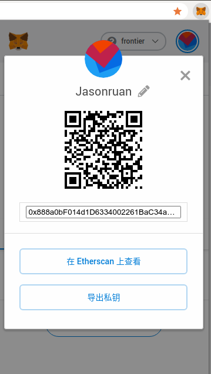

- 修改`frontier/template/node/src/chain_spec.rs`，添加以下内容：

```rust
+  29 use std::str::FromStr;

! 141         let built_in_evm_account =
! 142             H160::from_str("888a0bF014d1D6334002261BaC34a16f5Ce963ac").unwrap();
! 143         let mut evm_accounts = BTreeMap::new();
! 144         //let ten: u128 = 10;
! 145         evm_accounts.insert(
! 146             built_in_evm_account,
! 147             evm::GenesisAccount {
! 148                 nonce: 0.into(),
! 149                 balance: (2018030320150719 as u128 * 10_u128.pow(18)).into(),    // 设置账户初始ETH余额，注意ETH有18位小数
! 150                 storage: BTreeMap::new(),                                                                                                                                   
! 151                 code: WASM_BINARY.to_vec(),
! 152             },  
! 153         );  
```

#### 编译

```bash
$ cargo build --release
```

#### 运行

```bash
(master)$ ./target/release/frontier-template-node purge-chain --dev
Are you sure to remove "/root/.local/share/frontier-template-node/chains/dev/db"? [y/N]: y
"/root/.local/share/frontier-template-node/chains/dev/db" did not exist.

(master)$ ./target/release/frontier-template-node  --dev --ws-external --rpc-external --rpc-cors=all
2020-07-18 22:59:28 Substrate Node
2020-07-18 22:59:28 ✌️  version 2.0.0-dev-fcea972-x86_64-linux-gnu
2020-07-18 22:59:28 ❤️  by Parity Technologies <admin@parity.io>, 2017-2020
2020-07-18 22:59:28 📋 Chain specification: Development
2020-07-18 22:59:28 🏷  Node name: stimulating-hand-5352
2020-07-18 22:59:28 👤 Role: AUTHORITY
2020-07-18 22:59:28 💾 Database: RocksDb at /root/.local/share/frontier-template-node/chains/dev/db
2020-07-18 22:59:28 ⛓  Native runtime: node-frontier-template-1 (node-frontier-template-1.tx1.au1)
2020-07-18 22:59:28 🔨 Initializing Genesis block/state (state: 0x1e15…857d, header-hash: 0xa26e…22df)
2020-07-18 22:59:28 👴 Loading GRANDPA authority set from genesis on what appears to be first startup.
2020-07-18 22:59:29 ⏱  Loaded block-time = 6000 milliseconds from genesis on first-launch
2020-07-18 22:59:29 📦 Highest known block at #0
2020-07-18 22:59:29 Using default protocol ID "sup" because none is configured in the chain specs
2020-07-18 22:59:29 🏷  Local node identity is: 12D3KooWMgcWheT7cvvpaaKmqNLVPRpAkGLR9V1M7pfs43DxZU6c (legacy representation: QmRN3jaSxZV5dMk1P5tm1CB9oud8pU8SGZvrUFfuS9dNMQ)
2020-07-18 22:59:29 〽️ Prometheus server started at 127.0.0.1:9615
2020-07-18 22:59:30 🙌 Starting consensus session on top of parent 0xa26e0b7f2abed8a4bcf87ca45d20d7628cf22225dd522385e7b49ee6c30522df
2020-07-18 22:59:30 🎁 Prepared block for proposing at 1 [hash: 0xd3558be2df939b94ba94d82ded332216b0b06a55596d0a61a858aeaf7acc16c4; parent_hash: 0xa26e…22df; extrinsics (1): [0xead1…ac1b]]
2020-07-18 22:59:30 🔖 Pre-sealed block for proposal at 1. Hash now 0x8aa38d1228213371249ff83404bd8576e3e0bce6e120f93a9fe08ec2dfdc2d86, previously 0xd3558be2df939b94ba94d82ded332216b0b06a55596d0a61a858aeaf7acc16c4.
2020-07-18 22:59:30 ✨ Imported #1 (0x8aa3…2d86)
2020-07-18 22:59:34 💤 Idle (0 peers), best: #1 (0x8aa3…2d86), finalized #0 (0xa26e…22df), ⬇ 0 ⬆ 0
2020-07-18 22:59:36 🙌 Starting consensus session on top of parent 0x8aa38d1228213371249ff83404bd8576e3e0bce6e120f93a9fe08ec2dfdc2d86
2020-07-18 22:59:36 🎁 Prepared block for proposing at 2 [hash: 0x570be59726cf2018fab9e7bae77208a990921291fe8164bbc1df253f8142d3f6; parent_hash: 0x8aa3…2d86; extrinsics (1): [0xec7f…0d17]]
2020-07-18 22:59:36 🔖 Pre-sealed block for proposal at 2. Hash now 0xe9831c239f29745d79b0e72cc26c0db19ce4d0c7712a32dae4cc60f8ad538551, previously 0x570be59726cf2018fab9e7bae77208a990921291fe8164bbc1df253f8142d3f6.
2020-07-18 22:59:36 ✨ Imported #2 (0xe983…8551)
```

### MetaMask接入frontier链

#### 配置自定义RPC接入

> 这里`ChainID`填42，源于`runtime`中的定义：
>
> ```rust
> parameter_types! {
>     pub const EVMModuleId: ModuleId = ModuleId(*b"py/evmpa");
>     pub const ChainId: u64 = 42; 
> }
> 
> impl evm::Trait for Runtime {
>     type ModuleId = EVMModuleId;
>     type FeeCalculator = FixedGasPrice;
>     type ConvertAccountId = HashTruncateConvertAccountId<BlakeTwo256>;
>     type Currency = Balances;
>     type Event = Event;
>     type Precompiles = (); 
>     type ChainId = ChainId;
> }
> ```

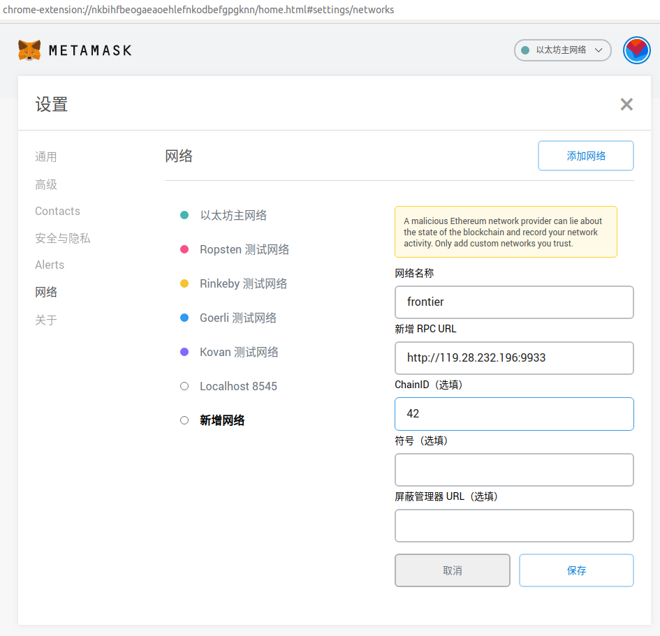

#### 查看账户余额

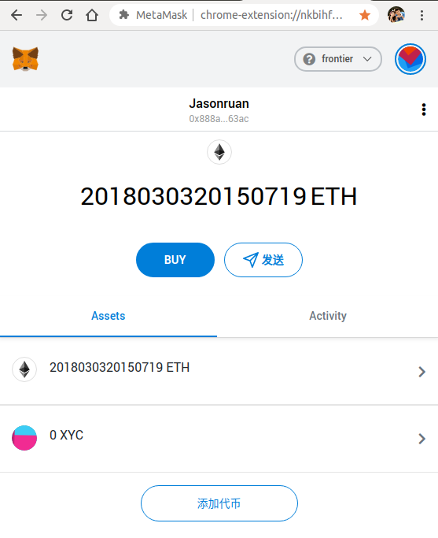

#### 开启Gas控制高级选项

> 开启该选项后，以便我们随意配置`gas limit`和`gas price`：

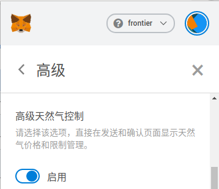

### remix接入MetaMask

#### 使用`Injected Web3`建立与`MetaMask`账号的连接

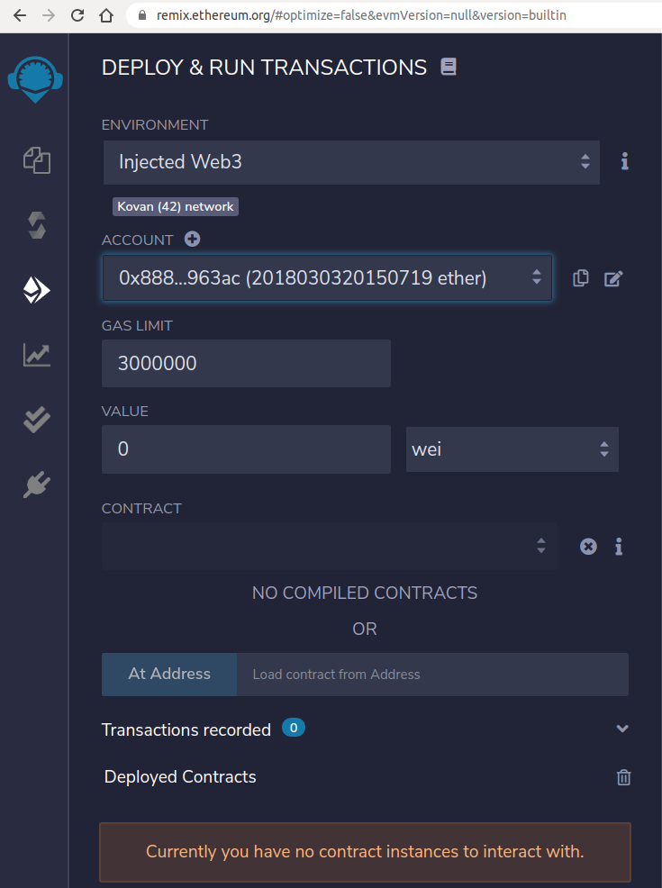


我们看到我们创建的账号已经成功接入`remix`，接下来，我们便可以进行`ERC20`合约的开发和部署了。

## 合约开发&部署

### 智能合约编写

我们要编写两个合约，其中`SafeMath.sol`是一个算数运算防溢出的安全库，`xyc.sol`是一个`ERC20`智能合约。

#### SafeMath.sol

```js
pragma solidity ^0.6.0;

library SafeMath {
    function add(uint256 a, uint256 b) internal pure returns (uint256) {
        uint256 c = a + b;
        require(c >= a, "SafeMath: addition overflow");
        return c;
    }

    function sub(uint256 a, uint256 b) internal pure returns (uint256) {
        return sub(a, b, "SafeMath: subtraction overflow");
    }

    function sub(uint256 a, uint256 b, string memory errorMessage) internal pure returns (uint256) {
        require(b <= a, errorMessage);
        uint256 c = a - b;
        return c;
    }

    function mul(uint256 a, uint256 b) internal pure returns (uint256) {
        if (a == 0) {
            return 0;
        }
        require(c / a == b, "SafeMath: multiplication overflow");
        return c;
    }

    function div(uint256 a, uint256 b) internal pure returns (uint256) {
        return div(a, b, "SafeMath: division by zero");
    }

    function div(uint256 a, uint256 b, string memory errorMessage) internal pure returns (uint256) {
        require(b > 0, errorMessage);
        uint256 c = a / b;
        return c;
    }

    function mod(uint256 a, uint256 b) internal pure returns (uint256) {
        return mod(a, b, "SafeMath: modulo by zero");
    }

    function mod(uint256 a, uint256 b, string memory errorMessage) internal pure returns (uint256) {
        require(b != 0, errorMessage);
        return a % b;
    }
}
```

#### xyc.sol

```js
pragma solidity ^0.6.0;

import "./SafeMath.sol";

abstract contract ERC20 {
   function totalSupply() public virtual view returns (uint256);
   function balanceOf(address owner) public virtual view returns (uint256);
   function transfer(address to, uint256 value) public virtual returns (bool);
   function transferFrom(address from, address to, uint256 value) public virtual returns (bool);
   function approve(address spender, uint256 value) public virtual returns (bool);
   function allowance(address owner, address spender) public virtual view returns (uint256);
   event Transfer(address indexed from, address indexed to, uint256 value);
   event Approval(address indexed owner, address indexed spender, uint256 value);
}

contract xyc is ERC20 {

    using SafeMath for uint256;

    string name = "XuanYuan Coin";
    string symbol = "xyc";
    uint8 decimals;
    uint256 private _totalSupply;
    mapping(address => uint256) private _balances;
    mapping(address => mapping(address => uint256)) private _allowances;

    constructor(uint256 myTotalSupply, uint8 mydecimals) public {
        _totalSupply = myTotalSupply;
        decimals = mydecimals;
        _balances[msg.sender] = myTotalSupply;
    }

   function totalSupply() public override view returns (uint256) {
       return _totalSupply;
   }

   function balanceOf(address _owner) public override view returns (uint256) {
       return _balances[_owner];
   }

   function transfer(address to, uint256 value) public override returns (bool) {
       require(to != address(0), "ERC20 ERROR: transfer from zero address");
       require(value <= _balances[msg.sender]);
       require(_balances[to] + value >= _balances[to]);

       _balances[msg.sender] = _balances[msg.sender].sub(value);
       _balances[to] = _balances[to].add(value);

       emit Transfer(msg.sender, to, value);

       return true;
   }

   function transferFrom(address from, address to, uint256 value) public override returns (bool) {
       require(to != address(0));
       require(value <= _balances[from]);
       require(value <= _allowances[from][msg.sender]);
       require(_balances[to] + value >= _balances[to]);

       _balances[from] = _balances[from].sub(value);
       _balances[to] = _balances[to].add(value);
       _allowances[from][msg.sender] = _allowances[from][msg.sender].sub(value);

       emit Transfer(from, to, value);

       return true;
   }

   function approve(address spender, uint256 value) public override returns (bool) {
       require(value <= _balances[msg.sender]);
       _allowances[msg.sender][spender] = value;
       emit Approval(msg.sender, spender, value);
       return true;
   }

   function allowance(address _owner, address spender) public override view returns (uint256) {
       return _allowances[_owner][spender];
   }

   event Transfer(address indexed from, address indexed to, uint256 value);
   event Approval(address indexed owner, address indexed spender, uint256 value);
}
```

### 智能合约编译

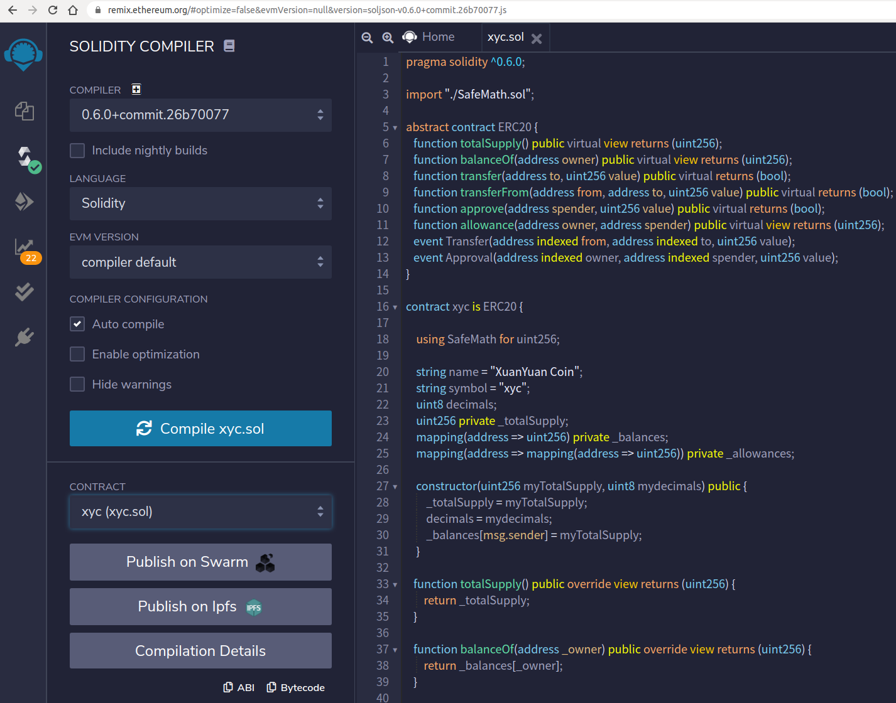

经验证，智能合约编译成功，接下来我们就将已经开发完成的`Solidity ERC20`智能合约部署到`Substrate`链上。

### 智能合约部署

- 选择要部署的合约，填写构造方法中的发行总量和精度两个参数，点击`transact`按钮

> 注：当前版本需要在弹出的MetaMask对话框上，设置很大的gas limit值（`4294967295`）才能部署成功:(

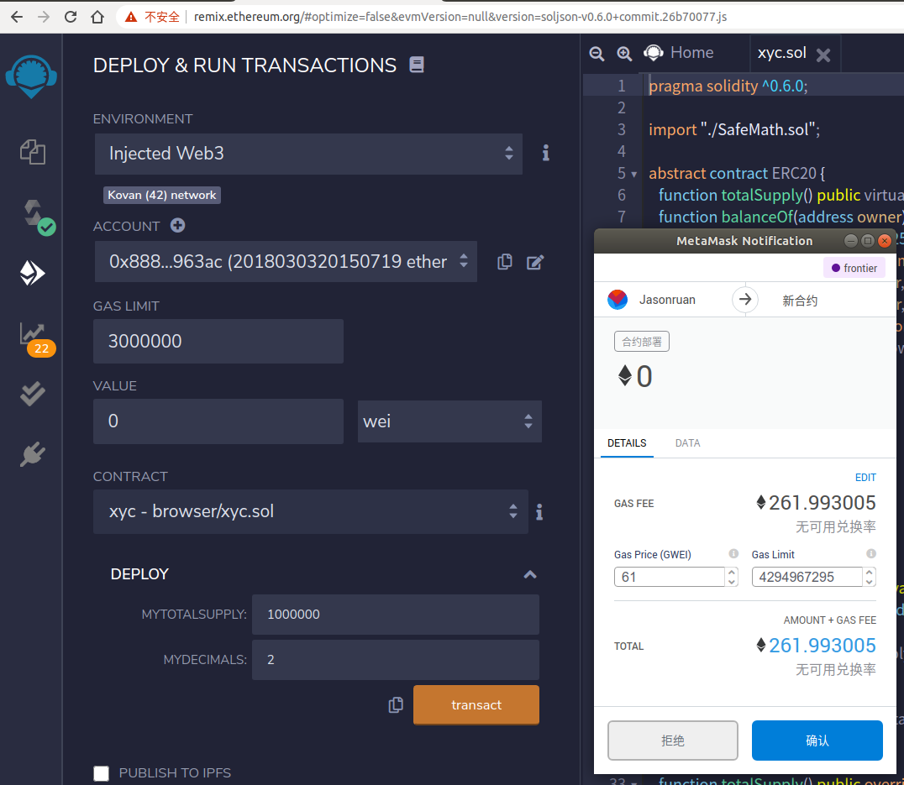

## 合约功能测试

通过remix完成对ERC20合约的功能测试。

### 查看发行量&余额

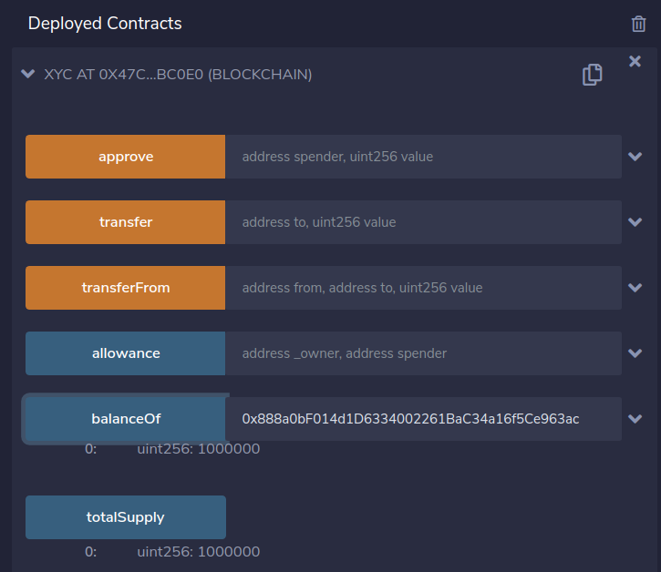

可见所有发行代币都归属于合约部署方地址。

### 转账测试

- 给账户2：`0x8A832874304Be72b299C0ED96f22B11311c9051C`，转账1000.00 XYC，查看账户1地址XYC代币数量为：9000.00，符合预期

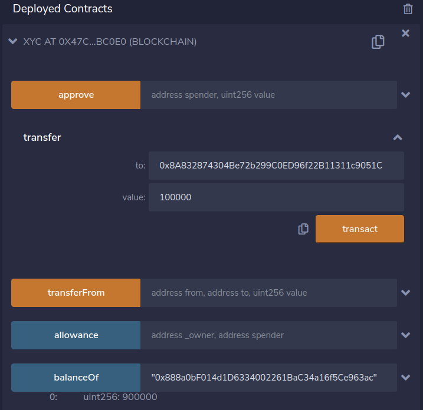

- 在MetaMask上添加自定义代币

> 合约地址：`0xfE2dF1EE3783eBD46481e32d849acB49ec5004Bf`

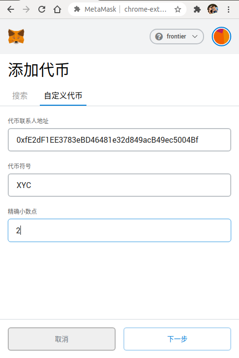

- 代币发行方地址所剩代币为：9000.00 XYC


- 代币接收方地址代币数量为：1000.00 XYC

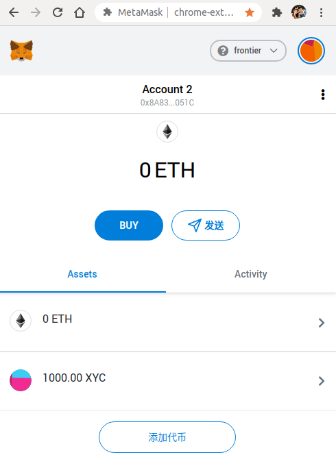


### 授权代理转账测试

- 为账户2转账ETH，用于支付gas费

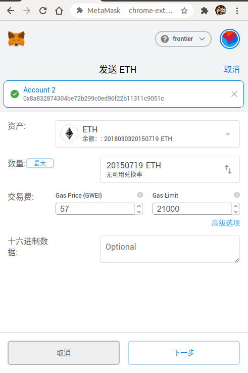

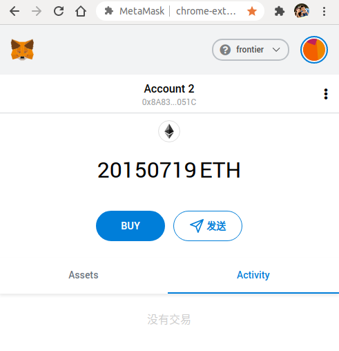

- 用户1授权用户2可代理转账的代币数量为2000.00 XYC

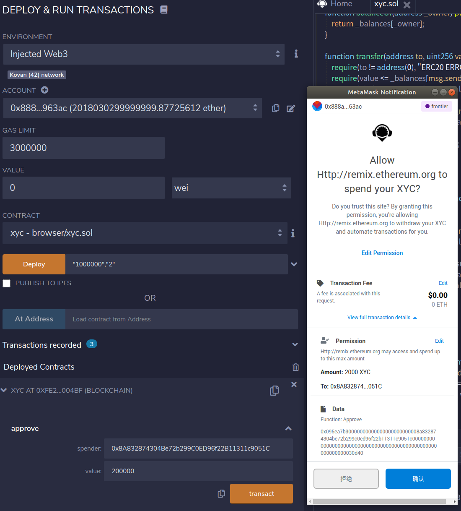

- 查看用户2所能授权转账用户1的XYC代币

| 账号      | 地址                                         |
| --------- | -------------------------------------------- |
| Jasonruan | `0x888a0bF014d1D6334002261BaC34a16f5Ce963ac` |
| Account 2 | `0x8A832874304Be72b299C0ED96f22B11311c9051C` |
| Account 3 | `0x6Be02d1d3665660d22FF9624b7BE0551ee1Ac91b` |

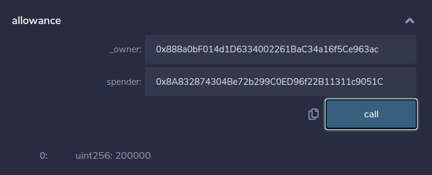

- 用户2代理用户1给用户3转账2000.00 XYC

> 成功转账后，查看到用户2所能授权转账用户1的XYC代币数量为0

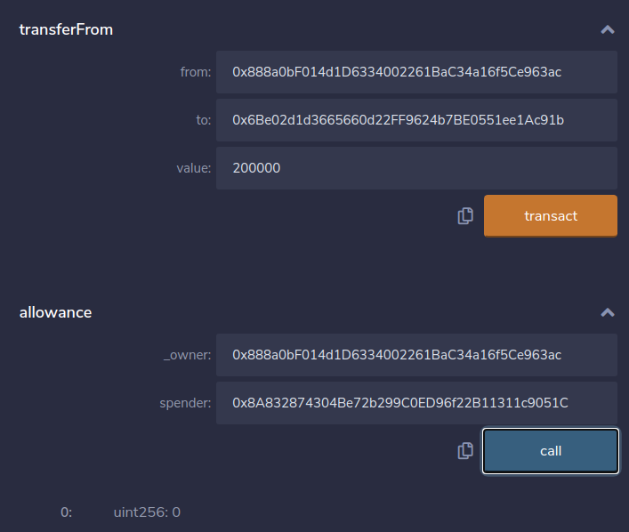

- 查看到账户3上XYC代币余额

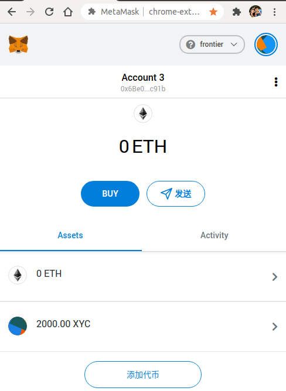

- 再次查看账户1上的代币余额

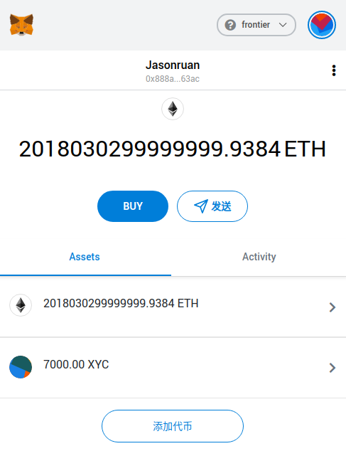


