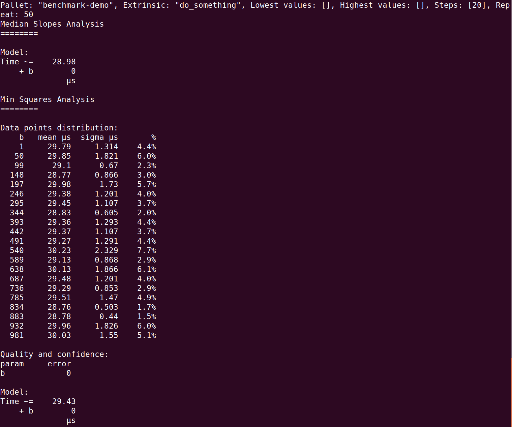
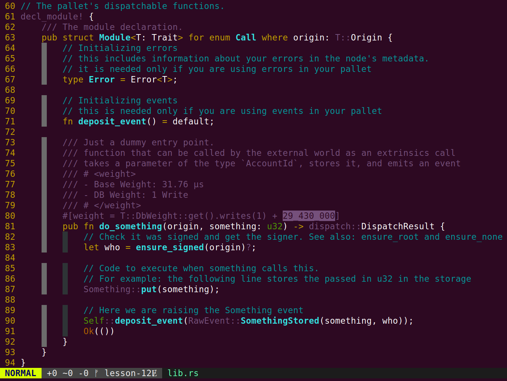
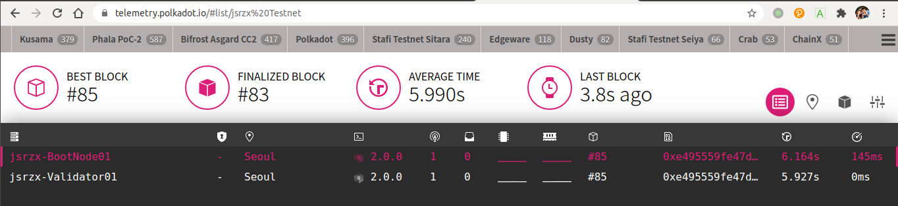

# Homework for lesson 12

答案放在README文件里即可。

## 1 为 template 模块的 do_something 添加 benchmark 用例（也可以是其它自选模块的可调用函数），并且将 benchmark 运行的结果转换为对应的权重定义

Note: 上传benchmark运行结果的命令行截图和最终的可调用函数代码片段（包含权重设置）。

```bash
$ git clone git@github.com:kaichaosun/play-substrate.git benchmark-node-template

# 编译feature需要进入node子目录进行
$ cd benchmark-node-template/node
[Jason@RUAN:~/YiKuaiSubstrate/team1/lesson12/benchmark-node-template/node] (lesson-12)$ cargo build --features runtime-benchmarks --release

[Jason@RUAN:~/YiKuaiSubstrate/team1/lesson12/benchmark-node-template] (lesson-12)$ ./target/release/node-template benchmark --chain dev --execution=wasm --wasm-execution=compiled --pallet benchmark-demo --extrinsic do_something --steps 20 --repeat 50
```





## 2 选择 node-template 或者其它节点程序，生成 Chain Spec 文件（两种格式都需要）

Note: 上传 Chain Spec 文件即可

https://github.com/jsrzx/team1/blob/lesson-12/lesson12/substrate-node-template/customSpec.json

https://github.com/jsrzx/team1/blob/lesson-12/lesson12/substrate-node-template/customSpecRaw.json

## 3（附加题）根据 Chain Spec，部署公开测试网络

Note: 上传 telemetry.polkadot.io 上你的网络节点的截图，或者apps上staking页面截图。



