# 第二课作业 PoE 1

课程里会给出参考资料，大家一定要自己敲一遍**代码**！

注：

1. 下面的题目，都需要提交源代码，程序运行的命令行截图，前端apps 发送对应交易的截图；
2. 可以尝试别的数据类型，功能满足即可；
3. 在可调用函数里要有合理的检查；操作成功要触发事件；
4. 附加题不是必答的，但可以酌情加分。

## **第一题：实现存证模块的功能**

包括：

* 创建存证，可调用函数所接收参数为内容的哈希值 Vec<u8>
* 撤销存证，可调用函数所接收参数为内容的哈希值 Vec<u8>

### 1.1 编码

- **创建存证**

```rust
        #[weight = 0]
        pub fn create_claim(origin, claim: Vec<u8>) -> dispatch::DispatchResult {
            let sender = ensure_signed(origin)?;
     
            ensure!(!Proofs::<T>::contains_key(&claim), Error::<T>::ProofAlreadyExist);
     
            Proofs::<T>::insert(&claim, (sender.clone(), system::Module::<T>::block_number()));
     
            Self::deposit_event(RawEvent::ClaimCreate(sender, claim));
     
            Ok(())
        }
```

- **撤销存证**

```rust
        #[weight = 0]
        pub fn revoke_claim(origin, claim: Vec<u8>) -> dispatch::DispatchResult {
            let sender = ensure_signed(origin)?;
     
            ensure!(Proofs::<T>::contains_key(&claim), Error::<T>::ClaimNotExist);
     
            let (owner, _block_number) = Proofs::<T>::get(&claim);
     
            ensure!(owner == sender, Error::<T>::NotClaimOwner);
     
            Proofs::<T>::remove(&claim);
     
            Self::deposit_event(RawEvent::ClaimRevoke(sender, claim));
     
            Ok(())
        }  
```

### 1.2 编译

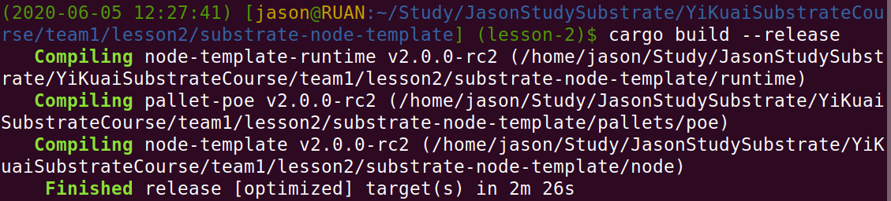

### 1.3 运行

- 执行命令

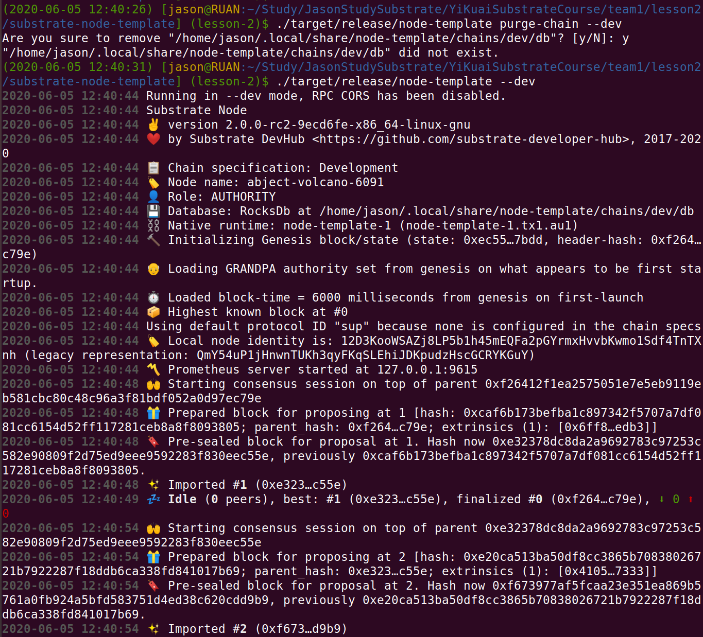

- 查看浏览器


### 1.4 测试

#### （1）创建存证交易

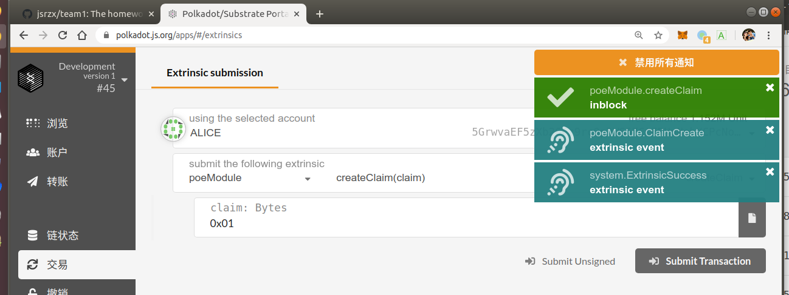

#### （2）查看交易状态

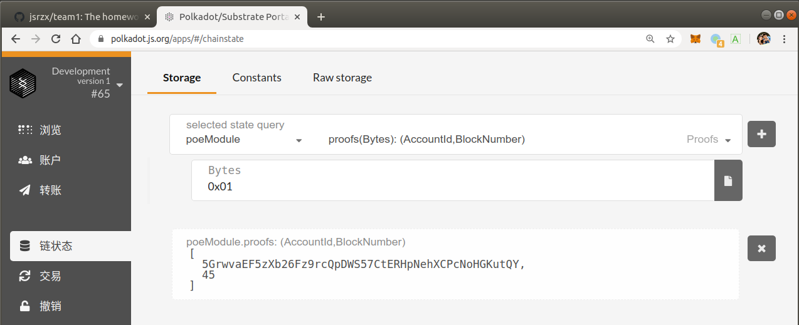

#### （3）吊销存证交易（非所有者账号）

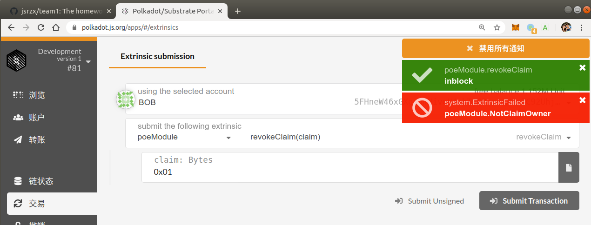

#### （4）吊销存证交易（所有者账号）

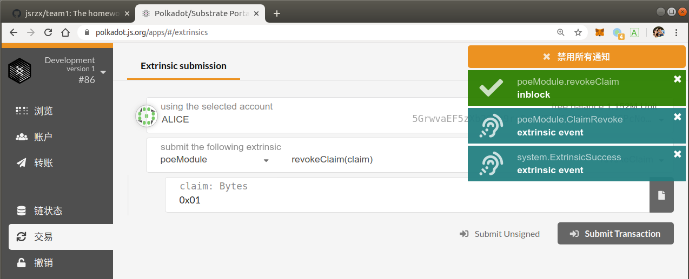

#### （5）查看链状态

> 可见又回到默认值。

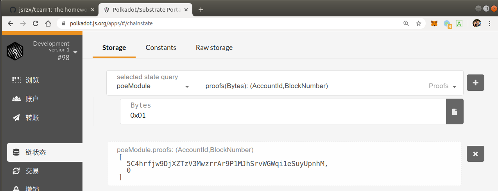

## **第二题：为存证模块添加新的功能**

* 转移存证，接收两个参数，一个是内容的哈希值，另一个是存证的接收账户地址；当存证不存在或者发送请求的用户不是存证内容的拥有人时，返回错误；当所有的检查通过后，更新对应的存证记录，并触发一个事件。

### 2.1 编码

```rust
        // 转移存证
        #[weight = 0]
        pub fn transfer_claim(origin, claim: Vec<u8>, receiver: T::AccountId) -> dispatch::DispatchResult {
            let sender = ensure_signed(origin)?;
    
            // 存证不存在
            ensure!(Proofs::<T>::contains_key(&claim), Error::<T>::ClaimNotExist);
    
            // 不是拥有者
            let (owner, block_number) = Proofs::<T>::get(&claim);
            ensure!(owner == sender, Error::<T>::NotClaimOwner);
    
            Proofs::<T>::remove(&claim);
            Proofs::<T>::insert(&claim, (receiver.clone(), block_number));
    
            Self::deposit_event(RawEvent::ClaimTransfer(receiver, claim));
    
            Ok(())
        }
```

### 2.2 编译

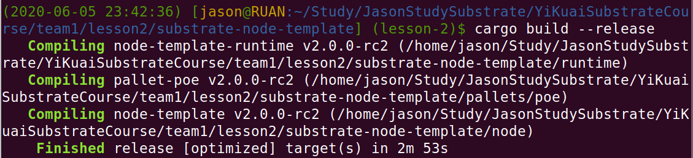

### 2.3 运行

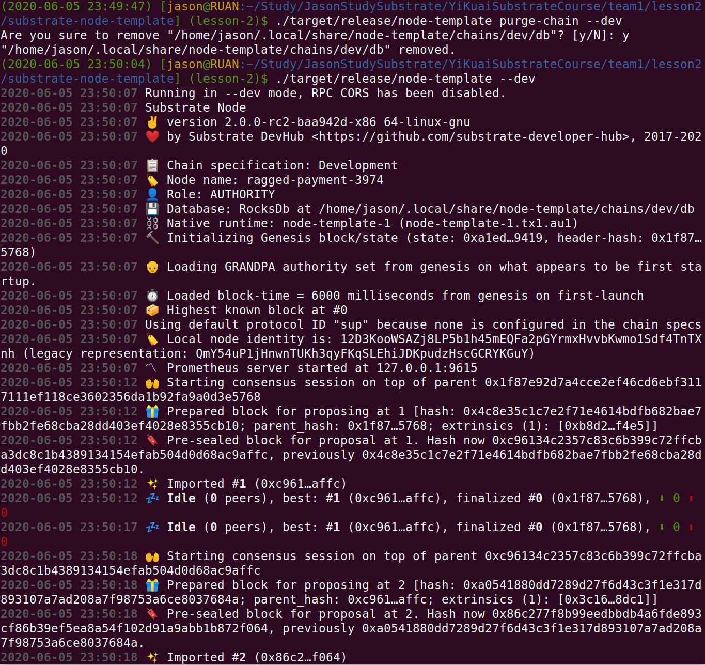

### 2.4 测试

#### （1）Alice创建存证交易

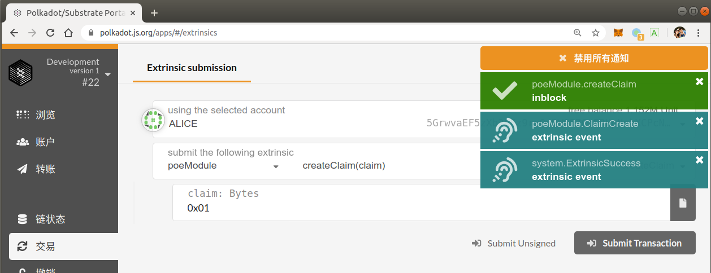

#### （2）查看存证交易

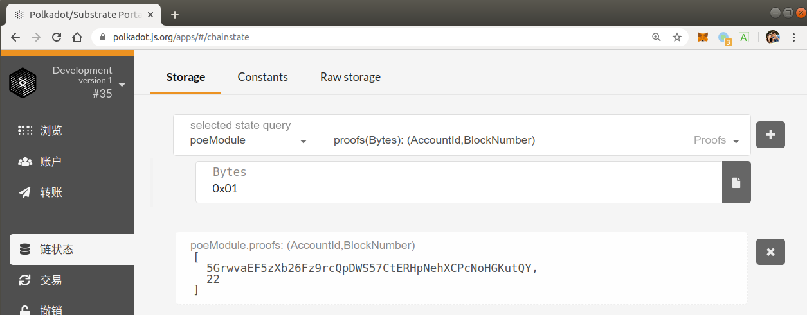

#### （3）Alice转移不存在存证


#### （4）Bob转移Alice存证

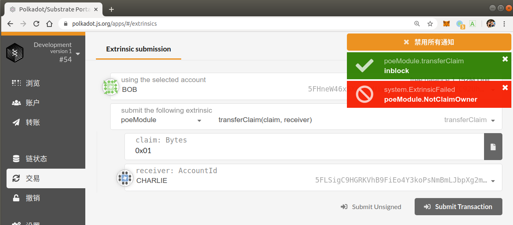

#### （5）Alice转移存证给Bob

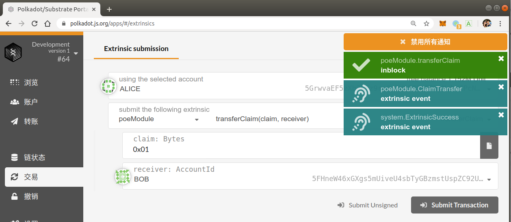

#### （6）再次查看存证状态

> 可见存证交易所在区块高度还是维持不变，归属人地址发生了变更，符合预期。

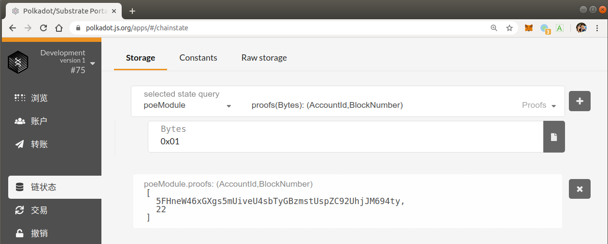


## **第三题（附加题）**

* 创建存证时，为存证内容的哈希值设置界限，如果超出界限，返回错误。

### 3.1 编码

> 设置存证内容哈希值长度只能是128bit

```rust
        // 创建存证
        #[weight = 0]
        pub fn create_claim(origin, claim: Vec<u8>) -> dispatch::DispatchResult {
            let sender = ensure_signed(origin)?;
 
            let hash_size = 16;
            ensure!(claim.len() == hash_size, Error::<T>::ClaimInvalidSize);
 
            ensure!(!Proofs::<T>::contains_key(&claim), Error::<T>::ProofAlreadyExist);
 
            Proofs::<T>::insert(&claim, (sender.clone(), system::Module::<T>::block_number()));
 
            Self::deposit_event(RawEvent::ClaimCreate(sender, claim));
 
            Ok(())
        }
```

### 3.2 编译

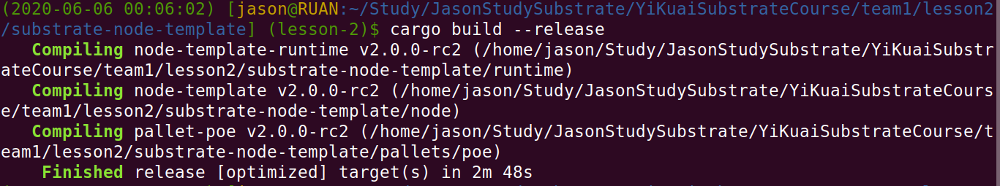

### 3.3 运行


### 3.4 测试

#### （1）传入合法哈希

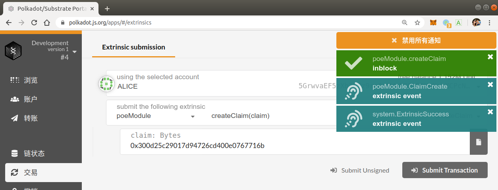

#### （2）传入非法哈希

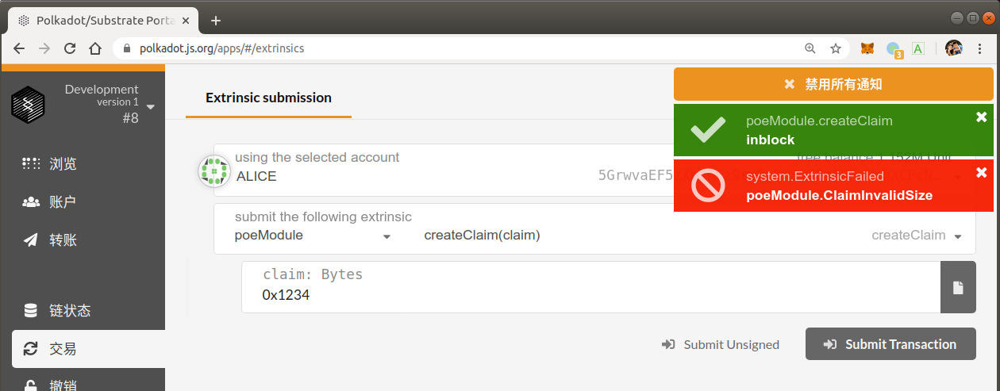

## 参考资料

["Proof Of Existence" dApp](https://www.substrate.io/tutorials/build-a-dapp/v2.0.0-rc2)

[Rust pattern match](https://doc.rust-lang.org/book/ch18-00-patterns.html)

[Enum](https://doc.rust-lang.org/book/ch06-01-defining-an-enum.html)

[Recoverable Errors with Result](https://doc.rust-lang.org/book/ch09-02-recoverable-errors-with-result.html)

[Generic Types, Traits](https://doc.rust-lang.org/book/ch10-00-generics.html)