# 第三课作业  PoE 2

[TOC]

课程里会给出参考资料，大家一定要自己敲一遍**代码**！

注：

1. 提交源代码，运行`cargo test`的测试结果截图，前端UI的截图；
2. 测试应覆盖所有的业务逻辑，如不同的错误场景，以及一切正常的情况下，检查存储的数据是不是预期的那样。
3. 附加题不是必答的，但可以酌情加分。
4. 代码修改在本目录 substrate-node-template 和 substrate-front-end-template 的程序文件里。

## 第一题：编写存证模块的单元测试代码

### 1.1 创建存证的测试用例

#### （1）编写测试用例

```rust
use super::*;
use crate::{mock::*, Error};
use frame_support::{assert_noop, assert_ok};

// test cases for create_claim
// 创建存证成功
#[test]
fn create_claim_works() {
    new_test_ext().execute_with(|| {
        let claim = vec![0, 1];
        assert_ok!(PoeModule::create_claim(Origin::signed(1), claim.clone()));
        assert_eq!(
            Proofs::<Test>::get(&claim),
            (1, system::Module::<Test>::block_number()),
        );
    })
}

// 创建存证失败：存证内容重复
#[test]
fn create_claim_failed_when_claim_already_exist() {
    new_test_ext().execute_with(|| {
        let claim = vec![0, 1];
        let _ = PoeModule::create_claim(Origin::signed(1), claim.clone());

        // 判断错误码
        assert_noop!(
            PoeModule::create_claim(Origin::signed(1), claim.clone()),
            Error::<Test>::ProofAlreadyExist
        );
    })
}

// 创建存证失败：存证内容过长
#[test]
fn create_claim_failed_when_claim_is_too_long() {
    new_test_ext().execute_with(|| {
        let claim = vec![0, 1, 2, 3, 4, 5, 6];

        assert_noop!(
            PoeModule::create_claim(Origin::signed(1), claim.clone()),
            Error::<Test>::ProofTooLong
        );
    })
}
```

#### （2）执行测试用例

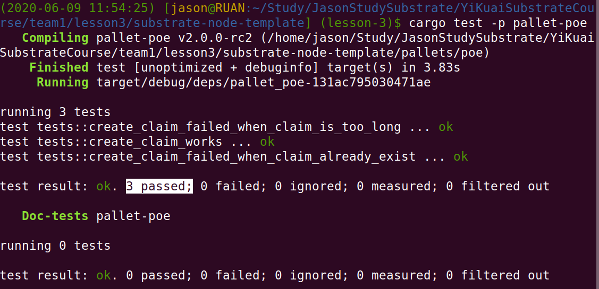

### 1.2 撤销存证的测试用例

#### （1）编写测试用例

```rust
use super::*;
use crate::{mock::*, Error};
use frame_support::{assert_noop, assert_ok};

// test cases for revoke_claim
// 撤销存证成功
#[test]
fn revoke_claim_works() {
    new_test_ext().execute_with(|| {
        let claim = vec![0, 1];
        let _ = PoeModule::create_claim(Origin::signed(1), claim.clone());

        // 判断错误码
        assert_ok!(PoeModule::revoke_claim(Origin::signed(1), claim.clone()));
    })
}

// 撤销存证失败：存证不存在
#[test]
fn revoke_claim_failed_when_claim_is_not_exist() {
    new_test_ext().execute_with(|| {
        let claim = vec![0, 1];

        assert_noop!(
            PoeModule::revoke_claim(Origin::signed(1), claim.clone()),
            Error::<Test>::ClaimNotExist
        );
    })
}

// 撤销存证失败：存证非所有者
#[test]
fn revoke_claim_failed_with_wrong_owner() {
    new_test_ext().execute_with(|| {
        let claim = vec![0, 1];

        let _ = PoeModule::create_claim(Origin::signed(1), claim.clone());

        assert_noop!(
            PoeModule::revoke_claim(Origin::signed(2), claim.clone()),
            Error::<Test>::NotClaimOwner
        );
    })
}
```

#### （2）执行测试用例

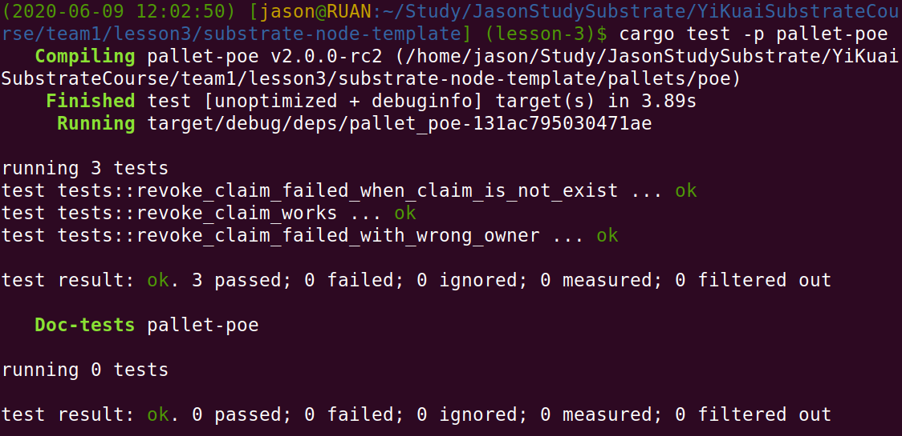

### 1.3 转移存证的测试用例

#### （1）编写测试用例

```rust
use super::*;
use crate::{mock::*, Error};
use frame_support::{assert_noop, assert_ok};

// test cases for transfer_claim
// 转移存证成功
#[test]
fn transfer_claim_works() {
    new_test_ext().execute_with(|| {
        let claim = vec![0, 1];
        let _ = PoeModule::create_claim(Origin::signed(1), claim.clone());

        assert_ok!(PoeModule::transfer_claim(
            Origin::signed(1),
            claim.clone(),
            2
        ));

        assert_eq!(
            Proofs::<Test>::get(&claim),
            (2, system::Module::<Test>::block_number()),
        );
    })
}

// 转移存证失败：存证不存在
#[test]
fn transfer_claim_failed_when_claim_is_not_exist() {
    new_test_ext().execute_with(|| {
        let claim = vec![0, 1];

        assert_noop!(
            PoeModule::transfer_claim(Origin::signed(1), claim.clone(), 2),
            Error::<Test>::ClaimNotExist
        );
    })
}

// 转移存证失败：存证非所有者
#[test]
fn transfer_claim_failed_with_wrong_owner() {
    new_test_ext().execute_with(|| {
        let claim = vec![0, 1];

        let _ = PoeModule::create_claim(Origin::signed(1), claim.clone());

        assert_noop!(
            PoeModule::transfer_claim(Origin::signed(2), claim.clone(), 3),
            Error::<Test>::NotClaimOwner
        );
    })
}
```

#### （2）执行测试用例

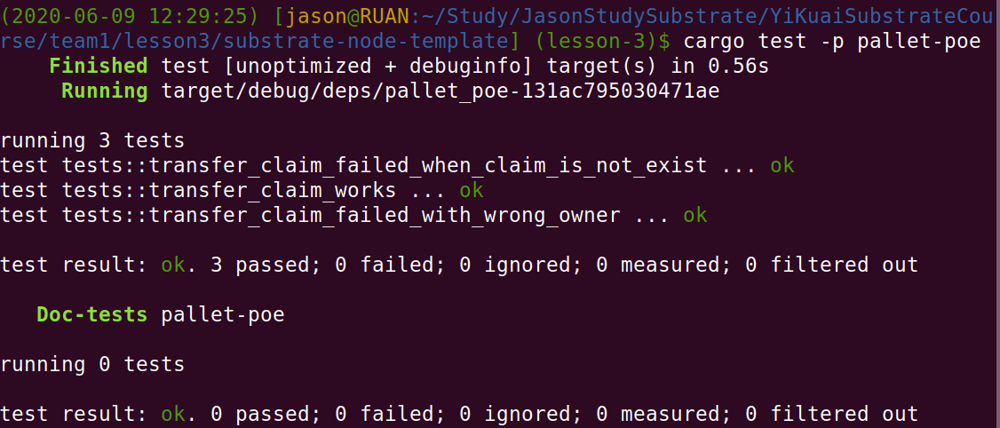

## 第二题：编写存证模块的UI

> - 安装yarn
>
> > 参考：https://linuxize.com/post/how-to-install-yarn-on-ubuntu-18-04/
>
> ```bash
> $ curl -sS https://dl.yarnpkg.com/debian/pubkey.gpg | sudo apt-key add -
> OK
> 
> $ echo "deb https://dl.yarnpkg.com/debian/ stable main" | sudo tee /etc/apt/sources.list.d/yarn.list
> deb https://dl.yarnpkg.com/debian/ stable main
> 
> $ sudo apt update
> 
> $ sudo apt-cache search yarn
> node-is-npm - Checks if your code is running as an npm script
> yarn - Fast, reliable, and secure dependency management.
> 
> $ yarn --version
> 1.22.4
> ```

### 2.1 创建存证的UI

#### （1）编写代码

```react
import React, { useEffect, useState } from 'react';
import { Form, Input, Grid } from 'semantic-ui-react';

import { useSubstrate } from './substrate-lib';
import { TxButton } from './substrate-lib/components';
import { blake2AsHex } from '@polkadot/util-crypto';

function Main (props) {
  const { api } = useSubstrate();
  const { accountPair } = props;

  // The transaction submission status
  const [status, setStatus] = useState('');
  const [digest, setDigest] = useState('');
  const [owner, setOwner] = useState('');
  const [blockNumber, setBlockNumber] = useState(0);

  useEffect(() => {
    let unsubscribe;
    api.query.poeModule.proofs(digest, (result) => {
      setOwner(result[0].toString());
      setBlockNumber(result[1].toNumber());
    }).then(unsub => {
      unsubscribe = unsub;
    })
      .catch(console.error);

    return () => unsubscribe && unsubscribe();
  }, [digest, api.query.poeModule]);

  const handleFileChosen = (file) => {
    const fileReader = new FileReader();

    const bufferToDigest = () => {
      const content = Array.from(new Uint8Array(fileReader.result))
        .map((b) => b.toString(16).padStart(2, '0'))
        .join('');

      const hash = blake2AsHex(content, 256);

      setDigest(hash);
    };

    fileReader.onloadend = bufferToDigest;

    fileReader.readAsArrayBuffer(file);
  };

  return (
    <Grid.Column width={8}>
      <h1>Proof of Existence Module</h1>
      <Form>
        <Form.Field>
          <Input
            type='file'
            id='file'
            lable='Your File'
            onChange={(e) => handleFileChosen(e.target.files[0])}
          />
        </Form.Field>

        <Form.Field>
          <TxButton
            accountPair={accountPair}
            label='Create Claim'
            setStatus={setStatus}
            type='SIGNED-TX'
            attrs={
              {
                palletRpc: 'poeModule',
                callable: 'createClaim',
                inputParams: [digest],
                paramFields: [true]
              }
            }
          />
        <div>{status}</div>
        <div>{`Claim info, owner: ${owner}, blockNumber: ${blockNumber}`}</div>
      </Form>
    </Grid.Column>
  );
}

export default function PoeModule (props) {
  const { api } = useSubstrate();
  return (api.query.poeModule && api.query.poeModule.proofs
    ? <Main {...props} /> : null);
}
```


#### （2）功能测试

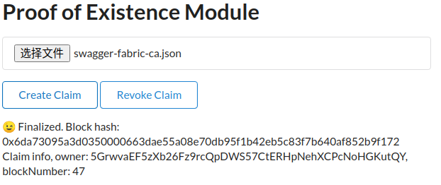

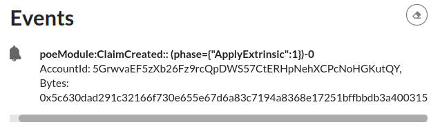


### 2.2 删除存证的UI

#### （1）编写代码

```react
 <Form.Field>
		 ......
          <TxButton
            accountPair={accountPair}
            label='Revoke Claim'
            setStatus={setStatus}
            type='SIGNED-TX'
            attrs={
              {
                palletRpc: 'poeModule',
                callable: 'revokeClaim',
                inputParams: [digest],
                paramFields: [true]
              }
            }
          />
        </Form.Field>
```

#### （2）功能测试

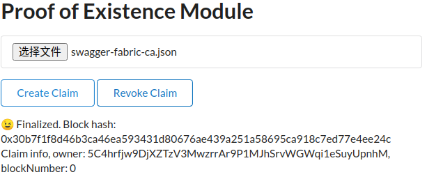

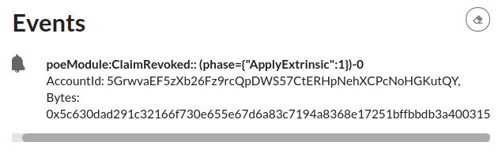

### 2.3 转移存证的UI

#### （1）编写代码

```react
  const [dest, setDest] = useState('');
  
    const onDestChange = (_, data) => {
    setDest(data.value);
  };
  
return (
    <Grid.Column width={8}>
      <h1>Proof of Existence Module</h1>
      <Form>
    	......
        <Form.Field>
          <Input
            type='text'
            label='To'
            placeholder='address'
            state='dest'
            onChange={onDestChange}
          />
        </Form.Field>

        <Form.Field>
    	......
          <TxButton
            accountPair={accountPair}
            label='Transfer Claim'
            setStatus={setStatus}
            type='SIGNED-TX'
            attrs={
              {
                palletRpc: 'poeModule',
                callable: 'transferClaim',
                inputParams: [digest, dest],
                paramFields: [true, true]
              }
            }
          />
        </Form.Field>

        <div>{status}</div>
        <div>{`Claim info, owner: ${owner}, blockNumber: ${blockNumber}`}</div>

      </Form>
    </Grid.Column>
  );
}
```

#### （2）功能测试

- **测试账号**

| 用户名 | 地址                                             |
| ------ | ------------------------------------------------ |
| alice  | 5GrwvaEF5zXb26Fz9rcQpDWS57CtERHpNehXCPcNoHGKutQY |
| bob    | 5FHneW46xGXgs5mUiveU4sbTyGBzmstUspZC92UhjJM694ty |

- **以alice身份创建存证**

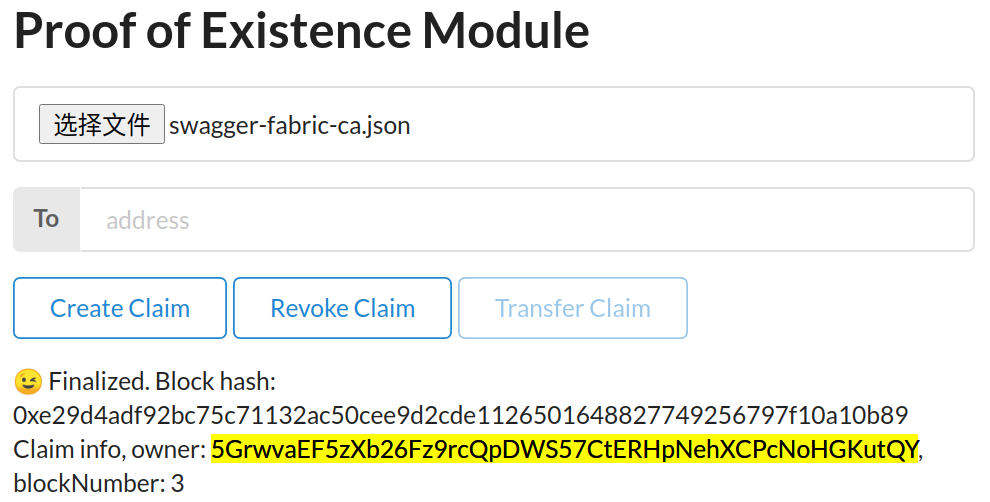

- **存证转移给bob**

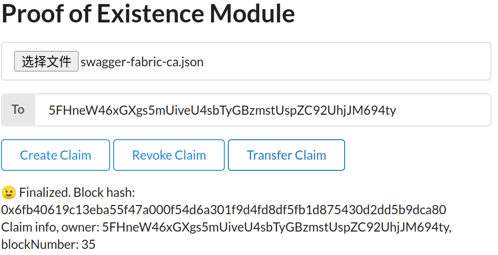


## 第三题（附加题）：实现购买存证的功能代码

* 用户A为自己的某个存证记录设置价格；
* 用户B可以以一定的价格购买某个存证，当出价高于用户A设置的价格时，则以用户A设定的价格将费用从用户B转移到用户A，再将该存证进行转移。如果出价低于用户A的价格时，则不进行转移，返回错误。

### 3.1 后端代码编写

```rust
        #[weight = 0]
        pub fn attach_claim_price(origin, claim: Vec<u8>, price: BalanceOf<T>) -> dispatch::DispatchResult {
            let sender = ensure_signed(origin)?;

            ensure!(Proofs::<T>::contains_key(&claim), Error::<T>::ClaimNotExist);

            let (owner, _block_number) = Proofs::<T>::get(&claim);

            ensure!(owner == sender, Error::<T>::NotClaimOwner);

            ensure!(!ProofsPrice::<T>::contains_key(&claim), Error::<T>::PriceAlreadySet);

            ProofsPrice::<T>::insert(&claim, price);

            Self::deposit_event(RawEvent::ClaimPriceCreated(sender, claim, price));

            Ok(())
        }

        #[weight = 0]
        pub fn buy_claim(origin, claim: Vec<u8>, price: BalanceOf<T>) -> dispatch::DispatchResult {
            let sender = ensure_signed(origin)?;

            ensure!(Proofs::<T>::contains_key(&claim), Error::<T>::ClaimNotExist);

            ensure!(ProofsPrice::<T>::contains_key(&claim), Error::<T>::ClaimPriceNotSet);

            let expect_price = ProofsPrice::<T>::get(&claim);

            let (owner, _) = Proofs::<T>::get(&claim);

            // 如果出价低于用户A的价格时，则不进行转移，返回错误
            ensure!(price >= expect_price, Error::<T>::PriceTooLow);

            // 当出价高于用户A设置的价格时，则以用户A设定的价格将费用从用户B转移到用户A
            T::Currency::transfer(&sender, &owner, expect_price, AllowDeath)?;

            // 再将该存证进行转移
            Proofs::<T>::insert(&claim, (&sender, system::Module::<T>::block_number()));
            ProofsPrice::<T>::remove(&claim);

            //Self::deposit_event(RawEvent::ClaimBought(sender, owner, claim, price, expect_price));

            Ok(())
        }

```

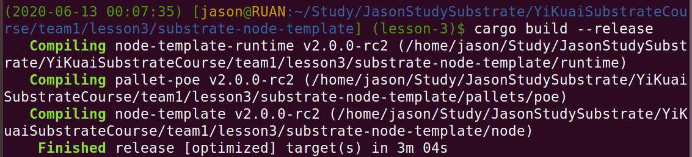

### 3.2 后端功能测试

#### 3.2.1 alice创建存证

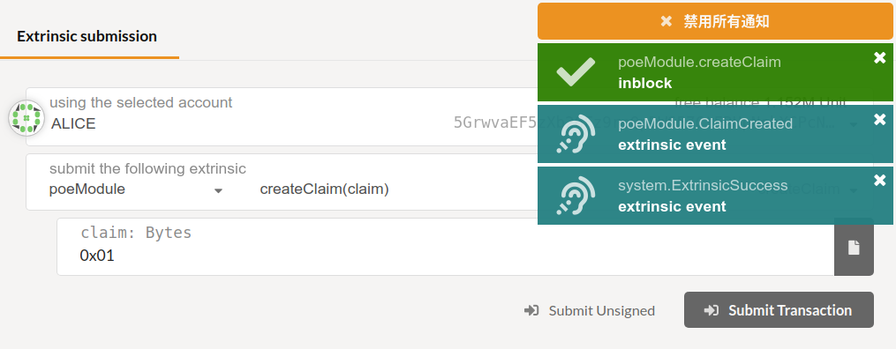

#### 3.2.2 alice为其存证设置价格

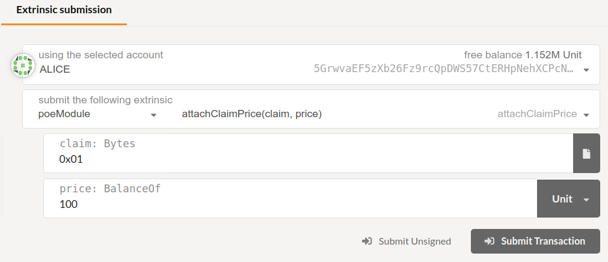

#### 3.3.3 bob以低于alice设置价格购买

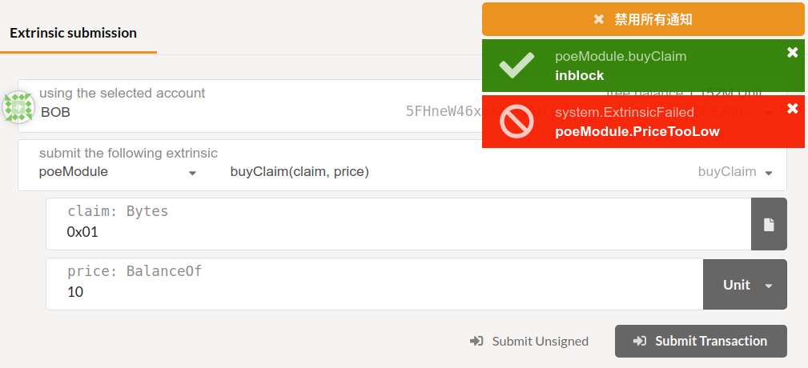

#### 3.3.4 bob以高于alice设置价格购买


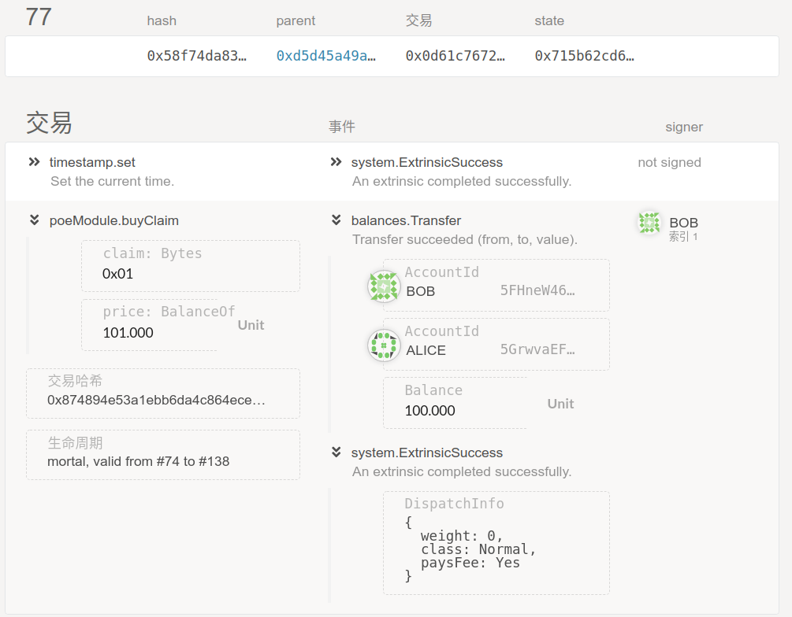

### 3.3 UI代码编写

```react
  const [amount, setAmount] = useState(0);

  const onAmountChange = (_, data) => {
    setAmount(data.value);
  }
  
          <Form.Field>
          <Input
            fluid
            label='Amount'
            type='number'
            state='amount'
            onChange={onAmountChange}
          />
        </Form.Field>
  
            <TxButton
            accountPair={accountPair}
            label='Attach Claim Price'
            setStatus={setStatus}
            type='SIGNED-TX'
            attrs={
              {
                palletRpc: 'poeModule',
                callable: 'attachClaimPrice',
                inputParams: [digest, amount],
                paramFields: [true, true]
              }
            }
          />

          <TxButton
            accountPair={accountPair}
            label='Buy Claim'
            setStatus={setStatus}
            type='SIGNED-TX'
            attrs={
              {
                palletRpc: 'poeModule',
                callable: 'buyClaim',
                inputParams: [digest, amount],
                paramFields: [true, true]
              }
            }
          />
```

### 3.4 UI功能测试

#### 3.4.1 **测试账号**

| 用户名 | 地址                                             |
| ------ | ------------------------------------------------ |
| alice  | 5GrwvaEF5zXb26Fz9rcQpDWS57CtERHpNehXCPcNoHGKutQY |
| bob    | 5FHneW46xGXgs5mUiveU4sbTyGBzmstUspZC92UhjJM694ty |

#### 3.4.2 alice创建存证

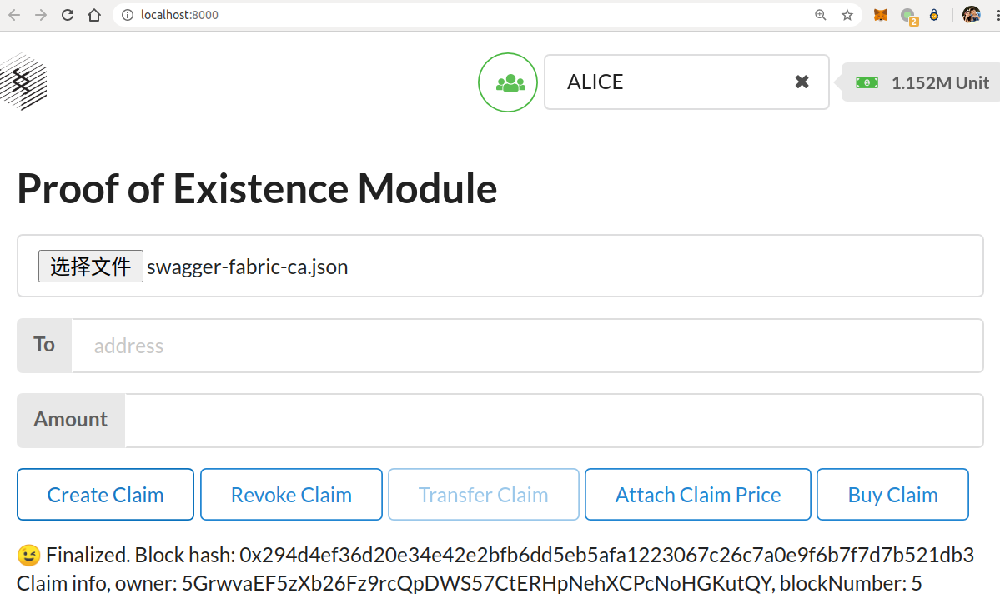

#### 3.4.3 alice为其存证设置价格

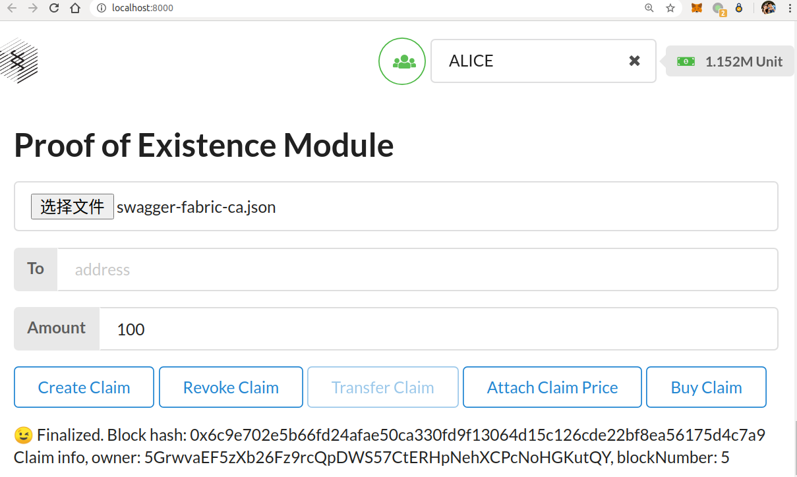

#### 3.4.4 bob以低于alice设置价格购买

> 切换到bob账号，以低于alice设置价格购买，交易完成后，存证归属无变化。

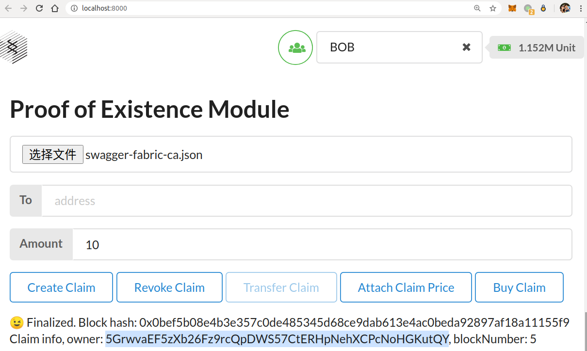

#### 3.4.5 bob以高于alice设置价格购买

> bob以高于alice设置价格购买，存证归属发生变化

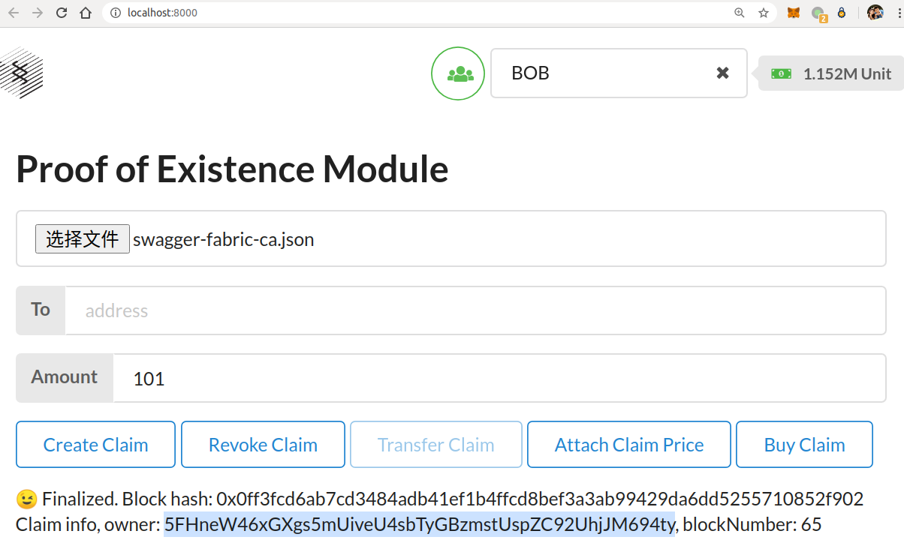

