# 006-jsrzx-hw-lesson5

## 完成作业代码

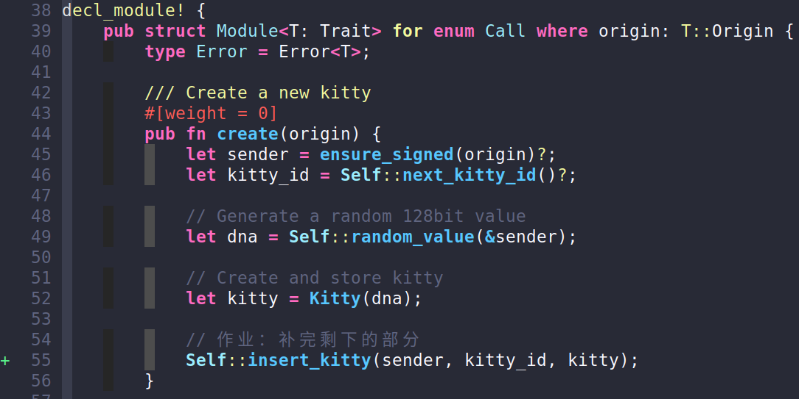

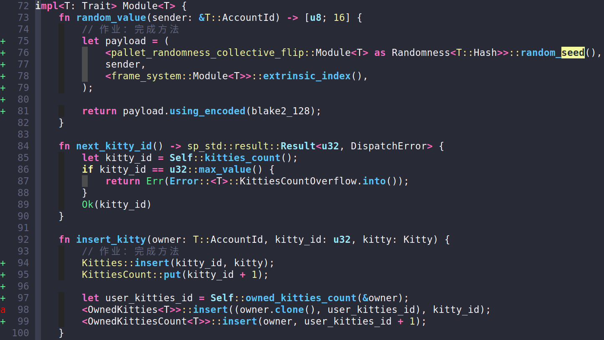

## 功能测试

### 使用polkadot.js

#### 创建小猫

> Alice创建2只小猫，Bob创建1只小猫

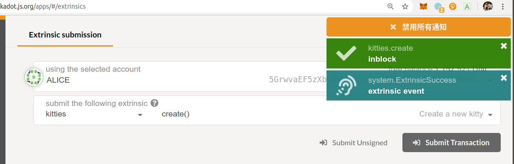

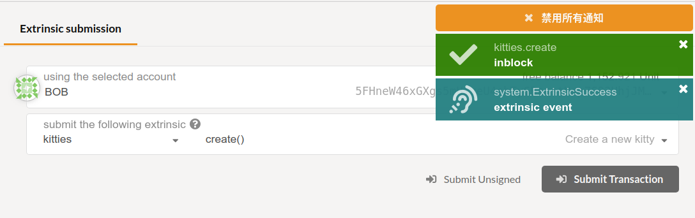

#### 繁殖小猫

> 将Alice的2只小猫进行繁殖，产生第3只Alice的小猫

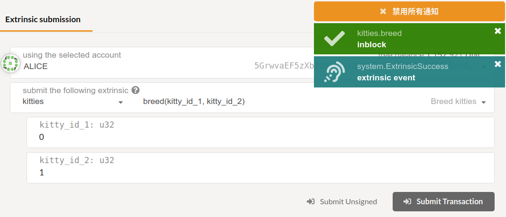

#### 查询小猫

> 设置类型：
>
> ```json
> {
>   "Kitty":"[u8;16]",
>   "KittyIndex":"u32",
>   "KittyLinkedItem":{
>     "prev":"Option<KittyIndex>",
>     "next":"Option<KittyIndex>"
>   }
> }
> ```
>
> 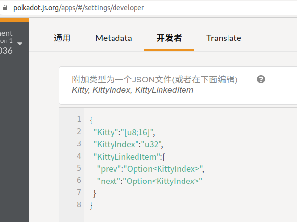

- 查到总共有4只小猫（Alice有3只，Bob有1只）

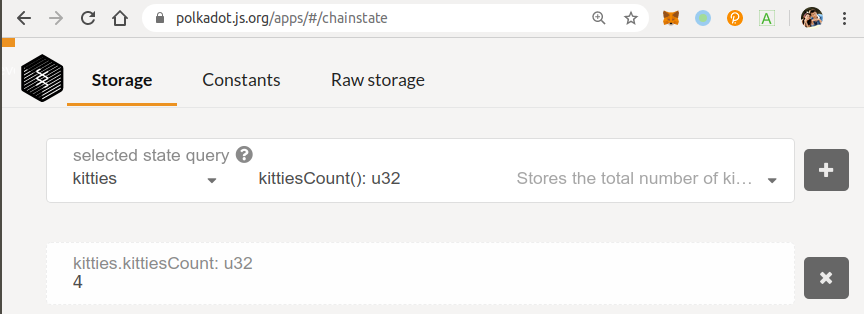

- 查询到Alice拥有小猫3只

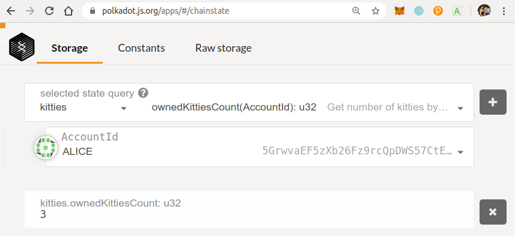

- 查询到Bob拥有小猫1只

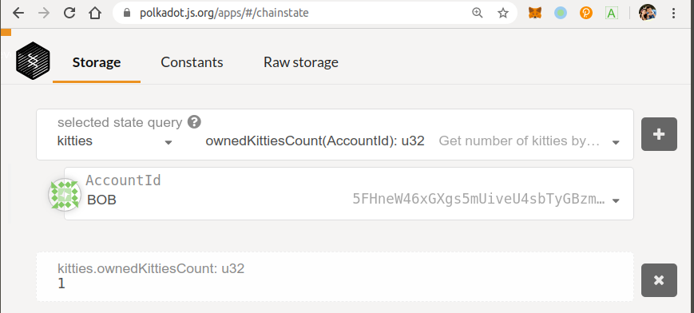

- 查询到Bob拥有的1只小猫的编号

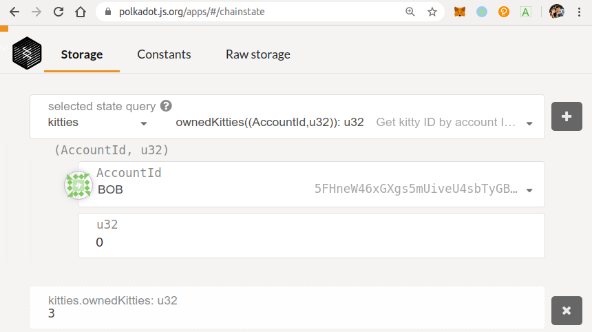

- 根据编号查到Bob小猫的DNA

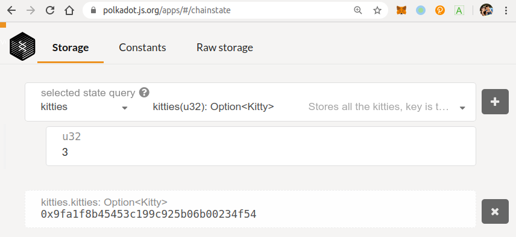

### 使用kitties-ui

> **准备工作**
>
> - 切换yarn版本：
>
> ```bash
> (2020-06-20 19:54:02) [jason@RUAN:~/Study/JasonStudySubstrate/YiKuaiSubstrateCourse/team1/lesson5/substrate-kitties-ui] (lesson-5)$ yarn --version
> 2.0.0-rc.36
> 
> (2020-06-20 19:54:58) [jason@RUAN:~/Study/JasonStudySubstrate/YiKuaiSubstrateCourse/team1/lesson5/substrate-kitties-ui] (lesson-5)$ yarn set version 1.22.4
> ➤ YN0000: Downloading https://github.com/yarnpkg/yarn/releases/download/v1.22.4/yarn-1.22.4.js
> ➤ YN0000: Saving the new release in .yarn/releases/yarn-1.22.4.cjs
> ➤ YN0000: Done in 7.13s
> 
> (2020-06-20 19:55:11) [jason@RUAN:~/Study/JasonStudySubstrate/YiKuaiSubstrateCourse/team1/lesson5/substrate-kitties-ui] (lesson-5)$ yarn --version
> 1.22.4
> 
> (2020-06-20 19:55:14) [jason@RUAN:~/Study/JasonStudySubstrate/YiKuaiSubstrateCourse/team1/lesson5/substrate-kitties-ui] (lesson-5)$ yarn install
> ```
> - 设置国内淘宝源
>
> ```bash
> $ yarn config set registry https://registry.npm.taobao.org
> yarn config v1.22.4
> success Set "registry" to "https://registry.npm.taobao.org".
> Done in 0.04s.
> 
> $ yarn config list
> ```
> - 如报错如下错误，执行`npm cache clean --force`清空npm缓存后重试：
>
> ```bash
> error An unexpected error occurred: "https://registry.npm.taobao.org/typescript/download/typescript-3.9.5.tgz?cache=0&sync_timestamp=1592637499175&other_urls=https%3A%2F%2Fregistry.npm.taobao.org%2Ftypescript%2Fdownload%2Ftypescript-3.9.5.tgz: unexpected end of file".
> ```

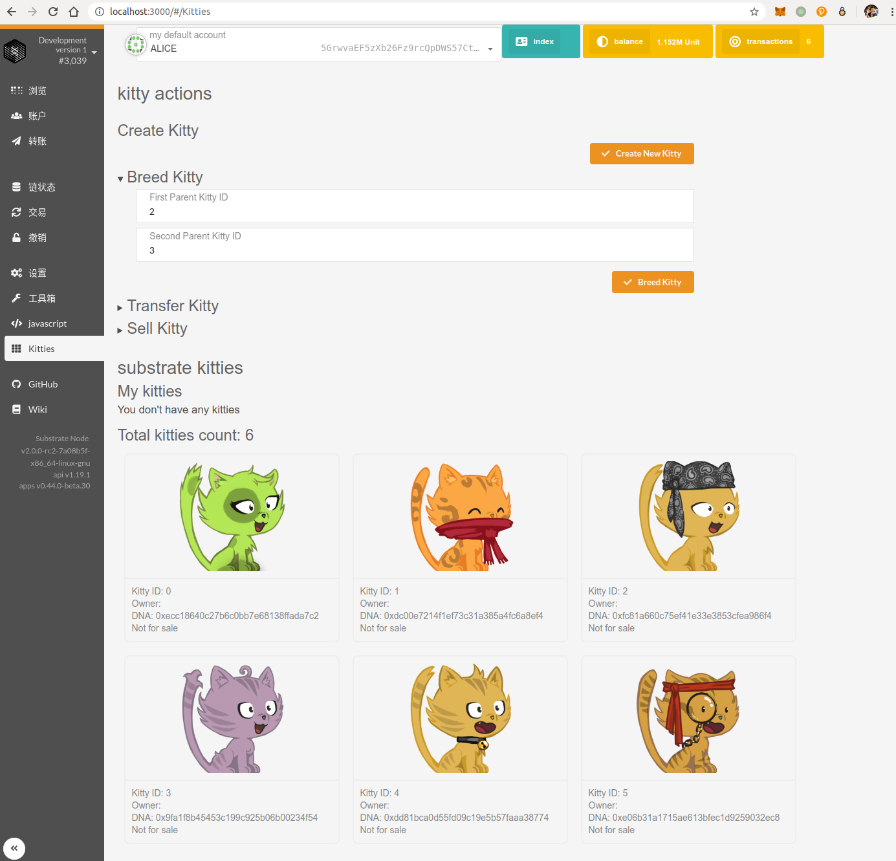