# 006-jsrzx-hw-lesson6

## 完成作业

### 作业点１

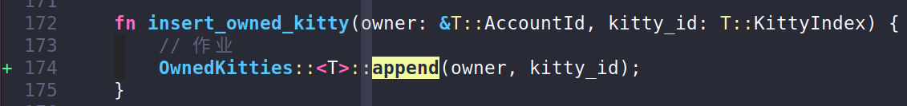

### 作业点２

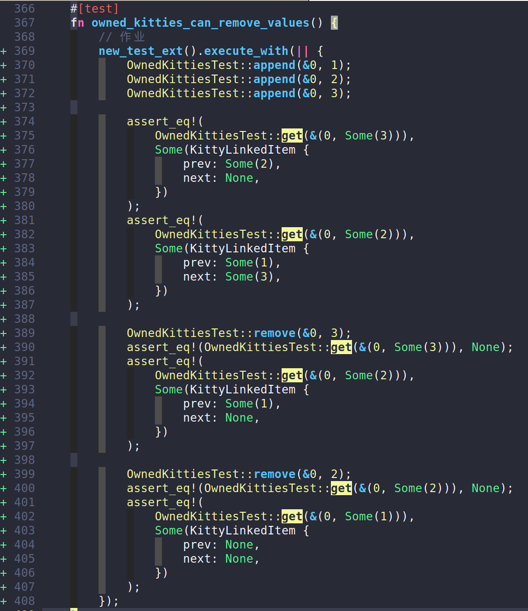

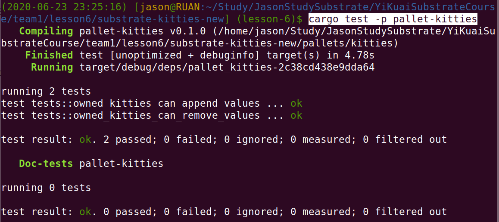

### 作业点３

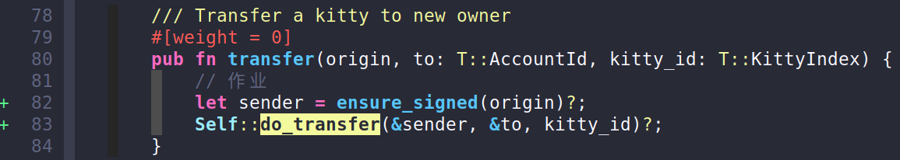


##　功能测试

> 启动网络：
>
> ```bash
> $ ./target/release/node-template purge-chain dev
> Are you sure to remove "/home/jason/.local/share/node-template/chains/dev/db"? [y/N]: y
> "/home/jason/.local/share/node-template/chains/dev/db" removed.
> 
> $ ./target/release/node-template  --dev
> ```

### （1）使用Alice账号创建5只小猫

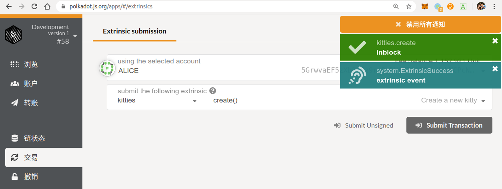

### （2）查看小猫总数

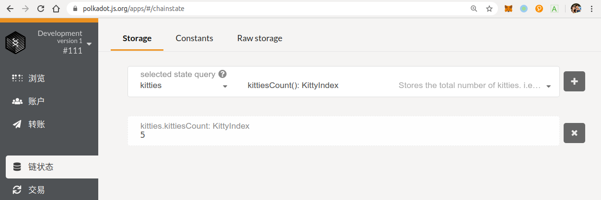

### （3）分别查看5只小猫链表关系

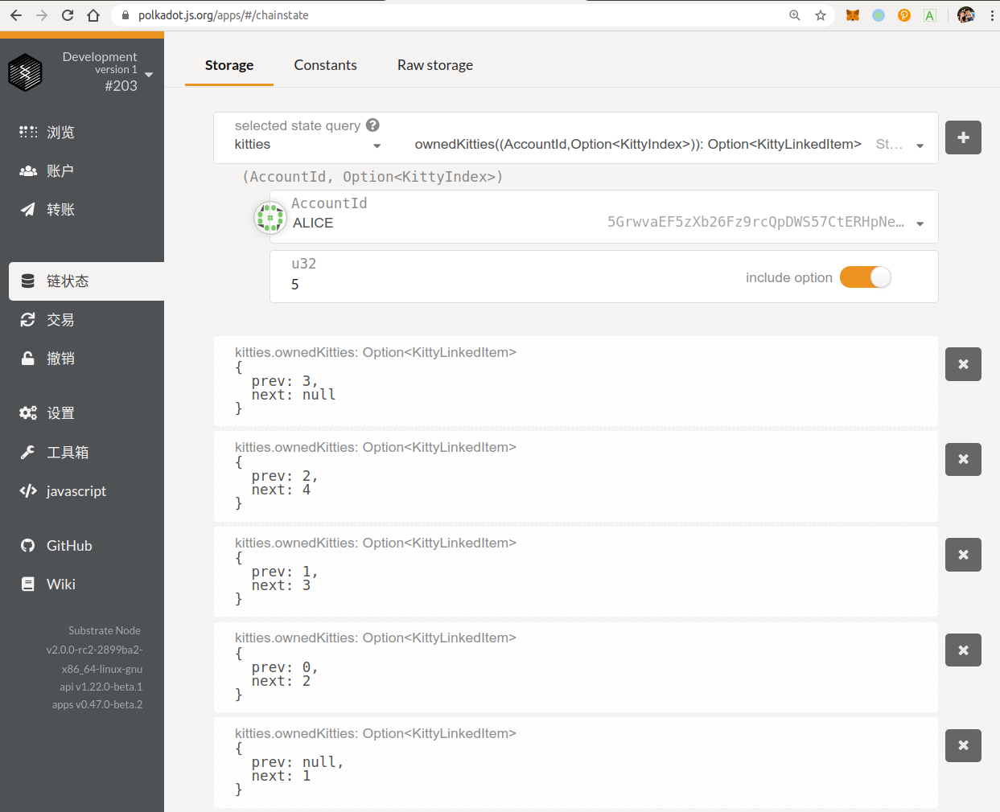

### （4）Alice转移给Bob一只不存在的小猫，将会报错

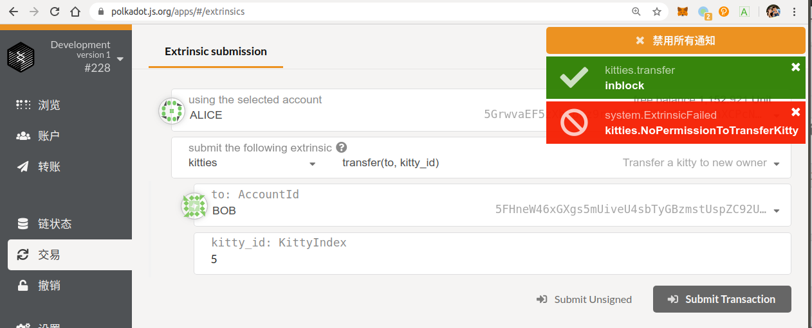

### （5）Alice转移属于自己编号为3的小猫给Bob

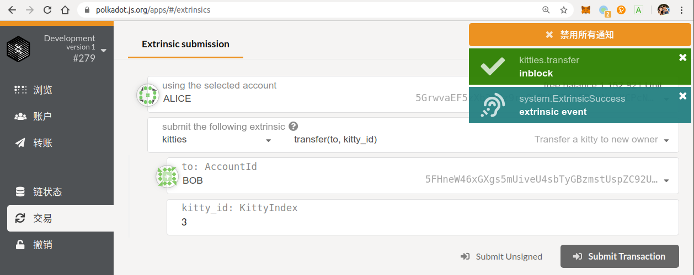

### （6）可见Alice编号已经查询不到编号为3的小猫，且链表索引已经做了重建

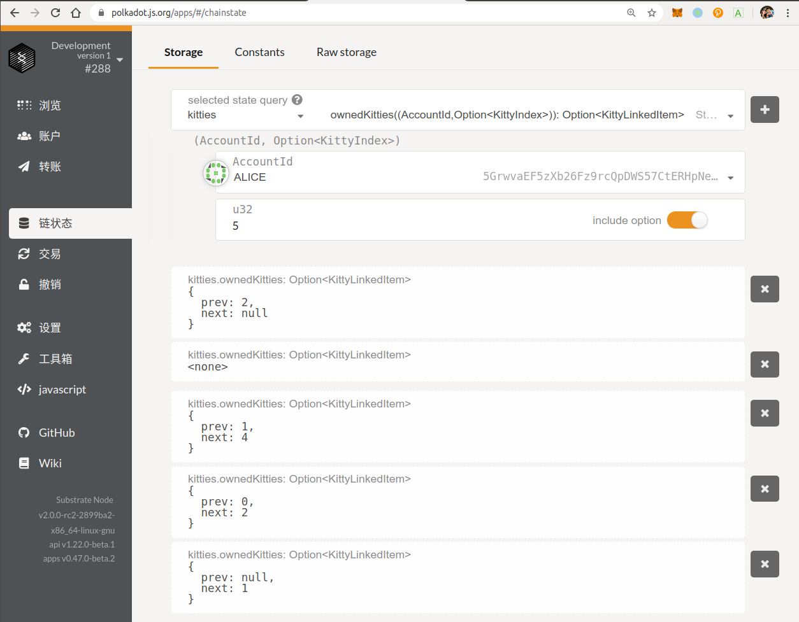

### （7）使用kitties-ui转移编号为2的小猫给Bob

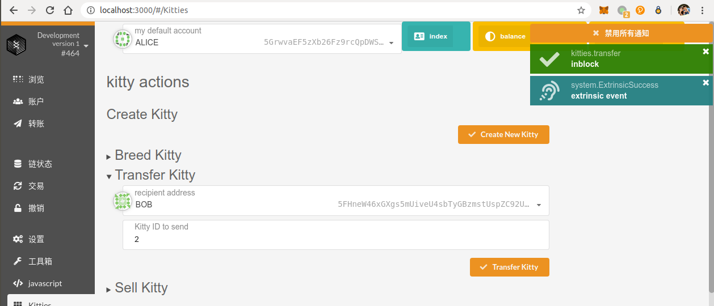

### （8）再此查看Alice拥有小猫的链表索引变化

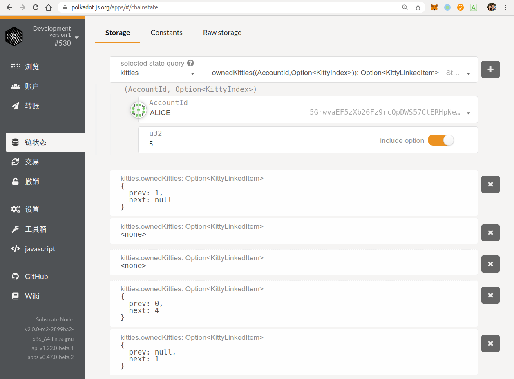

### （9）查看Bob拥有小猫的链表索引

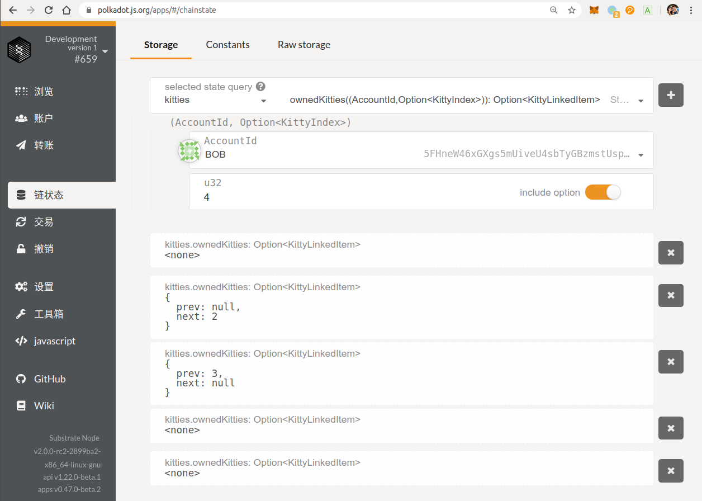

### 符合预期，通过测试。
