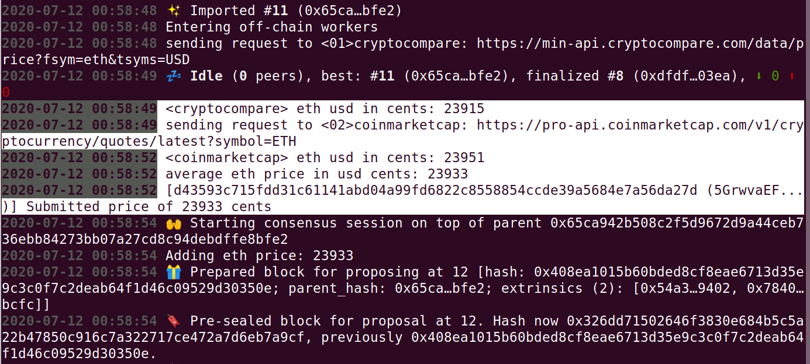
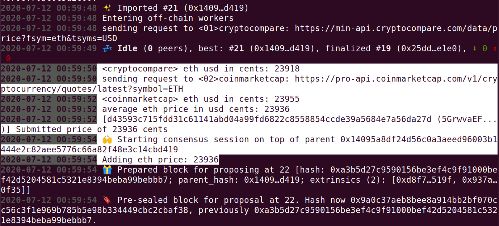
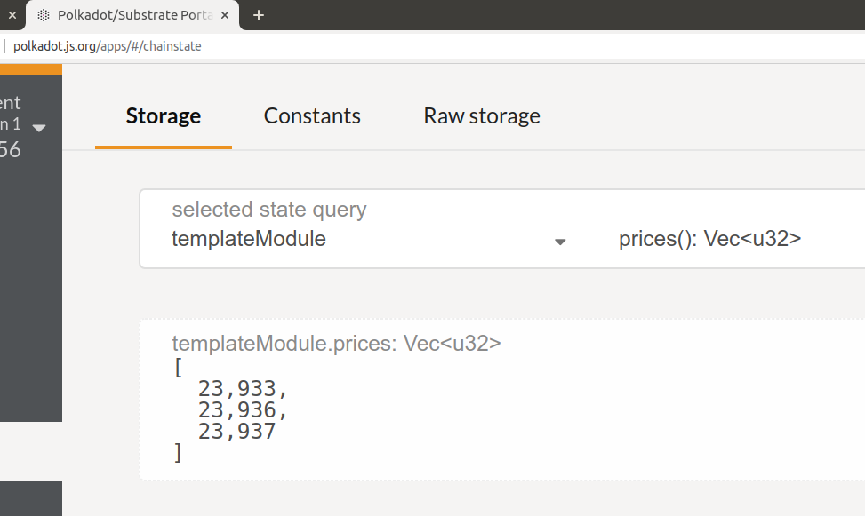
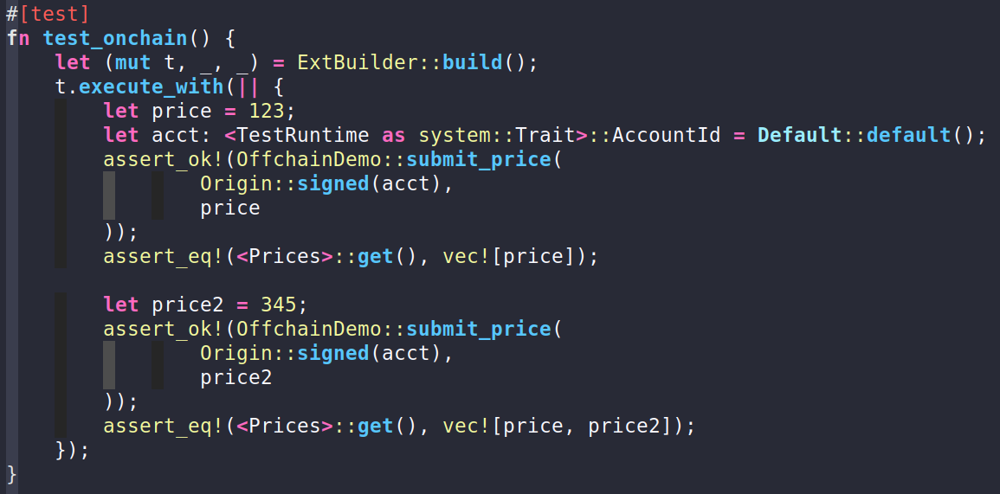
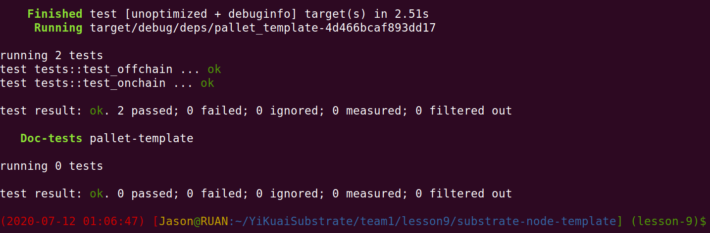

# 第九课作业

## 作业1

**(7 分)**

利用 off-chain worker，试从两个或以上的加密货币价格提供者 (最少两个)，透过其 API 取得 ETH 币的价格，
取其平均值，然后把它推 (append) 到 ocw 链下储存的 Vec 内。

加密货币价格提供者包括以下：
  - https://coinmarketcap.com/
  - https://coincap.io/
  - https://www.cryptocompare.com/
  - 其他你自己找到的提供者也可以


```bash
$ ./target/release/node-template  --dev --ws-external --rpc-external --rpc-cors=all
```








## 作业2

**(3 分)** 

附加题：为你的 ocw 写单元测试



```bash
$ cargo test -p pallet-template
```



## 资料搜集

### 参考文章

https://github.com/paritytech/substrate/blob/master/frame/example-offchain-worker/src/lib.rs

https://coinmarketcap.com/api/documentation/v1/#

https://serde.rs/attr-flatten.html

https://s0docs0rs.icopy.site/serde_json/1.0.56/serde_json/

### 调用请求

#### coinmarketcap.com

```json
$ curl -H "X-CMC_PRO_API_KEY: 6d479e2a-cd6d-489a-9697-b69f31ac5830"   "https://pro-api.coinmarketcap.com/v1/cryptocurrency/quotes/latest?symbol=ETH" | jq
{
  "status": {
    "timestamp": "2020-07-08T07:31:42.455Z",
    "error_code": 0,
    "error_message": null,
    "elapsed": 16,
    "credit_count": 1,
    "notice": null
  },
  "data": {
    "ETH": {
      "id": 1027,
      "name": "Ethereum",
      "symbol": "ETH",
      "slug": "ethereum",
      "num_market_pairs": 5065,
      "date_added": "2015-08-07T00:00:00.000Z",
      "tags": [
        "crowdfunding",
        "pow",
        "medium-of-exchange",
        "mineable",
        "smart-contracts",
        "ethash"
      ],
      "max_supply": null,
      "circulating_supply": 111669215.499,
      "total_supply": 111669215.499,
      "is_active": 1,
      "platform": null,
      "cmc_rank": 2,
      "is_fiat": 0,
      "last_updated": "2020-07-08T07:26:22.000Z",
      "quote": {
        "USD": {
          "price": 241.054142637,
          "volume_24h": 7398371790.94491,
          "percent_change_1h": 0.442721,
          "percent_change_24h": 1.72201,
          "percent_change_7d": 6.07455,
          "market_cap": 26918327001.05784,
          "last_updated": "2020-07-08T07:26:22.000Z"
        }
      }
    }
  }
}
```

#### cryptocompare.com

```bash
$ curl 'https://min-api.cryptocompare.com/data/price?fsym=eth&tsyms=USD'
{"USD":244.63}
```

